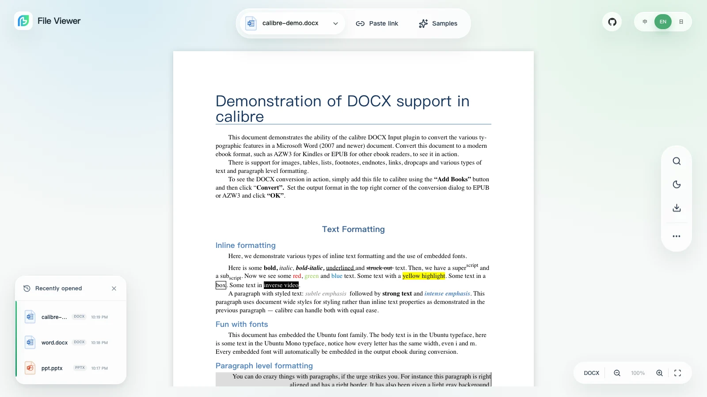

<p align="center">
  <a href="https://file-viewer.app/en/">
    
  </a>
</p>

<h1 align="center">File Viewer</h1>

<p align="center">
  <strong>A browser-native file viewer for private and internal web apps.</strong>
</p>

<p align="center">
  Keep private files in the browser. Preview Office, PDF/OFD, CAD, archives, email, images, media, and code without running a conversion service.
</p>

<p align="center">
  <a href="https://demo.file-viewer.app">Live Demo</a> ·
  <a href="https://doc.file-viewer.app/">Docs</a> ·
  <a href="https://github.com/flyfish-dev/file-viewer/wiki">GitHub Wiki</a> ·
  <a href="#quick-start">Quick Start</a> ·
  <a href="#supported-formats">Supported Formats</a>
</p>

<p align="center">
  <a href="README.md">English</a> · <a href="README.zh-CN.md">简体中文</a>
</p>

<p align="center">
  <a href="https://www.npmjs.com/package/@file-viewer/core"></a>
  <a href="https://www.npmjs.com/package/@file-viewer/vue3"></a>
  <a href="https://github.com/flyfish-dev/file-viewer"></a>
  <a href="https://github.com/flyfish-dev/file-viewer/releases"></a>
  <a href="https://doc.file-viewer.app"></a>
  <a href="https://github.com/flyfish-dev/file-viewer/wiki"></a>
  <a href="https://demo.file-viewer.app"></a>
  <a href="https://linux.do"></a>
  <a href="https://github.com/flyfish-dev/file-viewer/blob/main/LICENSE"></a>
  <a href="https://hub.docker.com/r/flyfishdev/file-viewer"></a>
  
  
  
</p>

<p align="center">
  <a href="https://demo.file-viewer.app"></a>
</p>

---

## Positioning

Uploading an internal DOCX just to preview it is awful. File Viewer keeps the preview path in the browser and gives internal tools, knowledge bases, approval flows, attachment centers, and engineering archives one API instead of a collection of unrelated viewers.

The current source catalog maps 245 registered extensions (222 stable, 23 experimental) to 35 preview pipelines. Office, PDF, OFD, Typst, CAD, STEP, XMind, archives, email, diagrams, media, source code, PSD, fonts, structured data, DICOM, and digital-signature containers share the same source, lifecycle, search, zoom, print, export, and download contracts. Heavy Worker, WASM, font, and vendor assets stay lazy and can be hosted entirely on your network.

New projects should prefer `@file-viewer/*`; historical `@flyfish-group/*` packages remain synchronized.

## Highlights

- **Start with one component.** Vanilla JS / Web Component comes first, with native packages for Vue, React, Svelte, and jQuery.
- **Use the checked matrix.** 245 registered extensions map to 35 preview pipelines across office, engineering, design, data, media, code, DICOM, and digital-signature attachments; 222 are stable and 23 are explicit experimental opt-ins.
- **Keep deployment private.** Browser-side rendering supports offline networks, Docker, private CDNs, and fully self-hosted runtime assets.
- **Modular.** Lightweight components, renderers, presets, and full packages are separated for clean dependency control.
- **Lazy loaded.** Heavy PDF, Office, CAD, Typst, archive, drawing, PSD, Mermaid, and WASM paths load only when needed.
- **Bounded multipage TIFF.** CCITT Group 4 TIFF pages decode progressively behind a TIFF-only lazy boundary, with shared zoom, rotation, fit width, page state, and lightbox access.
- **Vite-version aware.** Vite 5–7 retain Rollup `manualChunks`; Vite 8 receives Rolldown chunk groups without replacing application-owned groups or priorities.
- **Complete operations.** Search, highlight, zoom, print, HTML export, download, watermark, theme, lifecycle hooks, and before-operation guards share one API.
- **Consistent ecosystem.** Core owns preview capabilities; framework packages provide native wrappers with the same options, events, and controller semantics.

## Choose By Scenario

| User                      | What they care about                                         | Best entry                                                                                                          |
| ------------------------- | ------------------------------------------------------------ | ------------------------------------------------------------------------------------------------------------------- |
| Internal tools / OA teams | Word, Excel, PowerPoint, and PDF attachment preview          | [Quick Start](#quick-start) / [Office preset](https://doc.file-viewer.app/guide/quickstart)                         |
| Engineering archives      | DWG, DXF, DWF, and drawing triage                            | [Supported Formats](#supported-formats) / [Format Fidelity](https://doc.file-viewer.app/guide/format-fidelity)      |
| Frontend component users  | Vue / React / Web Component integration                      | [Ecosystem Packages](https://doc.file-viewer.app/guide/ecosystem)                                                   |
| Private deployment teams  | Offline assets, intranet hosting, Worker / WASM self-hosting | [Distribution](https://doc.file-viewer.app/guide/distribution) / [Docker](https://doc.file-viewer.app/guide/docker) |

## Live Demo


Open [demo.file-viewer.app](https://demo.file-viewer.app) to use the same product workspace shown above: a fixed glass toolbar, a filename capsule that opens the sample library, local recent-file memory, light and dark themes, responsive mobile controls, and a document-only scroll surface. The built-in samples cover Word, Excel, binary PPT, PPTX, PDF/OFD, DWG, STEP, archives, email, and the rest of the registered matrix; you can also upload a sanitized file or paste a URL.

## Compatibility Feedback

This project is still being refined, and real business files are the most useful way to validate compatibility.

If you have public or sanitized DOC / XLS / PPT / DWG / DWF / archive / email samples, please try them in the [demo](https://demo.file-viewer.app). Rendering differences, files that do not open, private deployment path issues, and mobile WebView failures are all useful issue reports.

If this direction is useful to you, starring or saving the project is welcome. Real compatibility feedback is even more valuable.

## Quick Start

Choose the integration layer first, then select the format capability. A `*-full` package already includes `preset-all`; complete npm deployments also publish its runtime assets once.

| Scenario                         | Recommended install                                                     |
| -------------------------------- | ----------------------------------------------------------------------- |
| Script tag / CDN full capability | `@file-viewer/web-full`                                                 |
| Vanilla JS npm                   | `@file-viewer/web` + `@file-viewer/preset-all`                          |
| Vue 3                            | `@file-viewer/vue3-full`, or `@file-viewer/vue3` + preset               |
| Vue 2.7 / 2.6                    | `@file-viewer/vue2.7-full` / `@file-viewer/vue2.6-full`                 |
| React 18/19                      | `@file-viewer/react-full`                                               |
| React 16.8/17                    | `@file-viewer/react-legacy-full`                                        |
| Svelte                           | `@file-viewer/svelte-full`                                              |
| jQuery                           | `@file-viewer/jquery-full`                                              |
| Exact capability cuts            | Any component package + `@file-viewer/preset-*` or standalone renderers |

The eight official Full packages are `@file-viewer/web-full`, `@file-viewer/vue3-full`, `@file-viewer/vue2.7-full`, `@file-viewer/vue2.6-full`, `@file-viewer/react-full`, `@file-viewer/react-legacy-full`, `@file-viewer/svelte-full`, and `@file-viewer/jquery-full`.

`*-full` means the published `preset-all` compatibility matrix and its same-version Worker, WASM, font, and vendor payload are included—do not install or pass another preset. Later specialist renderers such as DICOM and digital-signature containers remain explicit additions, so an unchanged Full dependency does not grow without bound. Vite publishes packaged assets automatically; other bundlers self-host them with the same-version CLI included by the Full package.

| Build / delivery path                            | Required asset step                                                                                                                                  |
| ------------------------------------------------ | ---------------------------------------------------------------------------------------------------------------------------------------------------- |
| Vite                                             | Install `@file-viewer/vite-plugin` and use `fileViewerRenderers({ copyAssets: true })`; dev and build publish the matching assets automatically.     |
| Webpack / Rspack / Rollup / Vue CLI / Umi        | Run the same-version CLI included by the Full package: `npx --no-install file-viewer-copy-assets ./public/file-viewer`.                              |
| `@file-viewer/web-full` CDN/IIFE or self-hosting | Use the CDN entry directly, or deploy its complete `dist/` directory intact; no copy command is required. Copying only the entry IIFE is incomplete. |

The default asset URL is `<deployment-base>/file-viewer/` (`/file-viewer/` at the origin root). Without that directory, lightweight formats and a few compatibility paths may still work, but the deployment is not full-format complete.

### CDN / Script Tag

```html
<script src="https://unpkg.com/@file-viewer/web-full@latest/dist/flyfish-file-viewer-web-full.iife.js"></script>

<flyfish-file-viewer
  src="/files/report.pdf"
  theme="light"
  toolbar-position="bottom-right"
  style="display:block;height:720px"
></flyfish-file-viewer>
```

The `web-full` CDN IIFE only loads the Custom Element, controller, and lazy full preset up front. Heavy PDF, Word, Excel, binary PPT, PPTX, CAD, Typst, archive, CHM, and similar renderer bundles are fetched asynchronously from `dist/renderers/*.iife.js` only when the active file type needs them. Deploy the complete `dist/`: it contains the verified `@file-viewer/ppt@0.3.3` ESM, Worker, WASM, CJK font, and frame-cache runtime under `vendor/ppt/`, the CHM Rust/WASM Worker under `vendor/chm/`, and the other version-aligned assets. Binary `.ppt` and CHM therefore work without runtime URL configuration. The format-specific URL options are advanced overrides for non-standard asset routing.

### Vanilla JS

```bash
npm i @file-viewer/web @file-viewer/preset-all
```

```ts
import { mountViewer } from '@file-viewer/web'
import presetAll from '@file-viewer/preset-all'

mountViewer(document.querySelector('#viewer')!, {
  url: '/files/report.docx',
  options: { preset: presetAll, theme: 'light' }
})
```

### Vue 3

```bash
npm i @file-viewer/vue3-full
```

```ts
import { createApp } from 'vue'
import App from './App.vue'
import FileViewer from '@file-viewer/vue3-full'

createApp(App).use(FileViewer).mount('#app')
```

```vue
<file-viewer url="/files/report.docx" />
```

### Vue 2

```bash
npm i @file-viewer/vue2.7-full
# Use @file-viewer/vue2.6-full for Vue 2.6 projects.
```

```ts
import Vue from 'vue'
import FileViewer from '@file-viewer/vue2.7-full'

Vue.use(FileViewer)
```

For Vue 2.6 + Vue CLI 3 / webpack 4 applications where importing `@file-viewer/preset-office` breaks the build, see the standalone [`examples/vue2.6-cli3-office`](./examples/vue2.6-cli3-office) project. It includes selective `transpileDependencies`, webpack 4 subpath aliases, PDF.js legacy `.mjs` compatibility, PPTX `import.meta.url` compatibility, a Vue CLI 3.1 HMR preview workaround, and offline worker asset copying.

### React

```bash
npm i @file-viewer/react-full
```

```tsx
import FileViewer from '@file-viewer/react-full'

export function Preview() {
  return <FileViewer url="/files/report.pdf" style={{ height: 720 }} />
}
```

### Svelte

```bash
npm i @file-viewer/svelte-full
```

```svelte
<script>
  import FileViewer from '@file-viewer/svelte-full'
</script>

<FileViewer url="/files/report.pdf" containerStyle="height:720px" />
```

### jQuery

```bash
npm i @file-viewer/jquery-full
```

```ts
import $ from 'jquery'
import installFileViewer from '@file-viewer/jquery-full'

installFileViewer($)
$('#viewer').fileViewer({ url: '/files/report.pdf' })
```

### Full Package Runtime Assets

Every full package points Archive, CHM, PDF, DOCX, Excel, binary PPT, PPTX, CAD, Typst, Draw.io, SQLite, and the remaining runtime assets to `file-viewer/` under the deployment base by default (`/file-viewer/` at the origin root). After Vite publishes the included assets or the bundled copy CLI writes `./public/file-viewer`, those URLs do not need to be configured. The verified `@file-viewer/ppt@0.3.3` runtime is included under `vendor/ppt/`; the CHM Worker, JavaScript bridge, and Rust/WASM binary are included under `vendor/chm/`; their license and notice files remain intact.

```ts
import { setDefaultFullAssetBaseUrl } from '@file-viewer/vue3-full'

setDefaultFullAssetBaseUrl('/static/file-viewer/')
```

Explicit `options.archive.*`, `options.pdf.*`, `options.typst.*`, and similar settings still take precedence for intranet gateways, tenant prefixes, or staged asset paths.

### Composed Imports

```bash
npm i @file-viewer/vue3 @file-viewer/preset-office
```

```ts
import officePreset from '@file-viewer/preset-office'

const options = {
  preset: officePreset,
  theme: 'light',
  toolbar: { position: 'bottom-right' }
}
```

Vite projects can add `@file-viewer/vite-plugin` to auto-discover installed presets and copy Worker/WASM/font/vendor assets. Non-Vite projects can use `options.preset` directly.

### Zero-Dependency iframe

When the host app should not install any npm package, download `file-viewer-v2-*-official-demo-iframe.tar.gz` from GitHub Releases, extract it to a static directory, and embed:

```html
<iframe
  src="/file-viewer/iframe.html?url=/files/report.docx"
  style="width:100%;height:720px;border:0"
  allow="fullscreen"
></iframe>
```

When the parent app must fetch the binary itself, post the `Blob` to the demo entry:

```html
<iframe
  id="viewer"
  src="/file-viewer/iframe.html?from=https%3A%2F%2Fapp.example.com&name=report.docx"
></iframe>
<script>
  const file = await fetch('/api/files/report.docx').then(response => response.blob())
  document.querySelector('#viewer').contentWindow.postMessage(file, 'https://static.example.com')
</script>
```

`iframe.html` is the recommended chrome-free entry, and clean-URL static hosts can also use `/iframe`. The original `index.html` demo entry keeps the same `url`, `from`, `name`, and `postMessage(Blob)` protocol for existing customer integrations.

## Architecture

- `@file-viewer/core`: format detection, source loading, renderer protocol, lifecycle, search, zoom, print, export, and controller APIs.
- `@file-viewer/renderer-*`: independent PDF, Word, PPT/PPTX, CAD, Typst, Archive, CHM, Drawing, Data, EDA, and other rendering capabilities.
- `@file-viewer/preset-*`: `lite`, `office`, `engineering`, and `all` capability bundles.
- `@file-viewer/web|vue3|vue2.7|vue2.6|react|react-legacy|svelte|jquery`: native component packages for each ecosystem.
- `@file-viewer/*-full`: component package plus `preset-all`; complete support also deploys same-version runtime assets under `<deployment-base>/file-viewer/`.

## Links

| Entry                            | URL                                                                                                |
| -------------------------------- | -------------------------------------------------------------------------------------------------- |
| Official site                    | [File Viewer official website](https://file-viewer.app/en/)                                        |
| Documentation                    | [doc.file-viewer.app](https://doc.file-viewer.app)                                                 |
| Live demo                        | [demo.file-viewer.app](https://demo.file-viewer.app)                                               |
| Comparison demo                  | [demo.file-viewer.app/compare.html](https://demo.file-viewer.app/compare.html)                     |
| Release downloads                | [github.com/flyfish-dev/file-viewer/releases](https://github.com/flyfish-dev/file-viewer/releases) |
| Docker image                     | `flyfishdev/file-viewer:latest`                                                                    |
| Linux Do friend link             | [linux.do](https://linux.do)                                                                       |
| Sponsorship and priority support | [dev.flyfish.group/sponsor?source=github](https://dev.flyfish.group/sponsor?source=github)         |

## Supported Formats

The source of truth is [`ecosystem/format-catalog.json`](ecosystem/format-catalog.json): the current source registers 245 unique extensions in 35 preview pipelines, with 222 stable and 23 experimental. The table groups those pipelines into readable product families and lists every registered extension.

| Category                       | Extensions                                                                                                                                                                                                                                                                                                                                               | Rendering pipeline                                                                                                                                                                                                                                                                                                                                               | Typical use                                                     |
| ------------------------------ | -------------------------------------------------------------------------------------------------------------------------------------------------------------------------------------------------------------------------------------------------------------------------------------------------------------------------------------------------------- | ---------------------------------------------------------------------------------------------------------------------------------------------------------------------------------------------------------------------------------------------------------------------------------------------------------------------------------------------------------------- | --------------------------------------------------------------- |
| Word                           | `docx`, `docm`, `dotx`, `dotm`                                                                                                                                                                                                                                                                                                                           | `@file-viewer/renderer-word` with the self-maintained `@file-viewer/docx` engine, Worker parsing, continuous flow reading, cached TOC fields, async rendering, print, and HTML export; visual pagination is opt-in                                                                                                                                               | Modern Word documents and templates                             |
| Legacy Word                    | `doc`, `dot`                                                                                                                                                                                                                                                                                                                                             | `@file-viewer/renderer-word` with `msdoc-viewer`, a Word-like paper surface, and CFB tolerance fixes                                                                                                                                                                                                                                                             | Old Word 97-2003 files                                          |
| Compatible documents           | `rtf`, `odt`                                                                                                                                                                                                                                                                                                                                             | `@file-viewer/renderer-word` with RTFJS or OpenDocument package parsing and a paper-like reading surface                                                                                                                                                                                                                                                         | RTF exports and OpenDocument text documents                     |
| Excel                          | `xlsx`, `xltx`                                                                                                                                                                                                                                                                                                                                           | `@file-viewer/renderer-spreadsheet` with `styled-exceljs`, virtual table rendering, merged cells, styles, auto text color, workbook images, optional header drag column resizing, fidelity-first main-thread parsing by default, and an explicit opt-in static Worker                                                                                            | Business spreadsheets and templates                             |
| Excel-compatible               | `xlsm`, `xlsb`, `xls`, `xlt`, `xltm`, `csv`, `tsv`, `ods`, `fods`, `numbers`                                                                                                                                                                                                                                                                             | CSV/TSV detects UTF-8, GBK, and GB18030, with `options.spreadsheet.textEncoding` for explicit overrides; the remaining formats use progressive spreadsheet parsing and the same virtual table surface                                                                                                                                                            | Legacy spreadsheets and lightweight data preview                |
| PowerPoint                     | `ppt`, `pptx`, `pptm`, `potx`, `potm`, `ppsx`, `ppsm`, `odp`                                                                                                                                                                                                                                                                                             | Binary `.ppt` uses the separate native-WASM `@file-viewer/ppt` engine; OpenXML files use `@file-viewer/pptx` with Worker-based progressive slides; ODP uses OpenDocument text extraction                                                                                                                                                                         | Presentations, training decks, proposals                        |
| PDF                            | `pdf`                                                                                                                                                                                                                                                                                                                                                    | `pdfjs-dist`, streaming same-origin loading, Range support, zoom, rotation, page thumbnails, outline tree, width fitting, print, HTML export                                                                                                                                                                                                                     | Contracts, invoices, official layout documents                  |
| OFD                            | `ofd`                                                                                                                                                                                                                                                                                                                                                    | Browser-side OFD preview based on `DLTech21/ofd.js` source                                                                                                                                                                                                                                                                                                       | Chinese e-invoices, government documents, archives              |
| Typst                          | `typ`, `typst`                                                                                                                                                                                                                                                                                                                                           | Direct Typst source rendering with browser WASM compiler, SVG renderer, and self-hosted font assets                                                                                                                                                                                                                                                              | Technical reports, papers, engineering documents                |
| Archives                       | `zip`, `zipx`, `7z`, `rar`, `tar`, `gz`, `gzip`, `tgz`, `bz2`, `bzip2`, `tbz`, `tbz2`, `xz`, `txz`, `lzma`, `zst`, `tzst`, `cab`, `ar`, `cpio`, `iso`, `xar`, `lha`, `lzh`, `jar`, `war`, `ear`, `apk`, `cbz`, `cbr`                                                                                                                                     | `@file-viewer/renderer-archive` with a `libarchive.js` Worker, directory listing, lazy extraction, nested preview, IndexedDB cache, CBZ/CBR comic navigation, legacy filename decoding, ZIP/TAR/GZIP fallback, and memory limits                                                                                                                                 | Attachment packages, comic books, and internal document bundles |
| Compiled HTML Help             | `chm`                                                                                                                                                                                                                                                                                                                                                    | `@file-viewer/renderer-chm` parses ITSF/ITSP directories and LZX content locally in a self-hosted Rust/WASM Worker; provides contents, index, search, internal links, and lazy resources; topic HTML runs with scripts disabled inside a sandboxed iframe and a restrictive CSP blocks plugins, forms, and remote active content                                                                                       | Offline help manuals and legacy SDK documentation               |
| Email                          | `eml`, `msg`, `mbox`                                                                                                                                                                                                                                                                                                                                     | Standalone `@file-viewer/renderer-email`; `postal-mime` for EML/MBOX, `@kenjiuno/msgreader` for MSG, headers, HTML/text body, attachment preview                                                                                                                                                                                                                 | Email archives and support tickets                              |
| EDA                            | `olb`, `dra`, `gds`, `oas`, `oasis`                                                                                                                                                                                                                                                                                                                      | Standalone `@file-viewer/renderer-eda`; CFB-based OrCAD / Allegro inspection; standard GDSII records are parsed into SVG for small layouts and WebGL canvas for larger element sets; readable OASIS text fixtures render as SVG, while real SEMI binary OASIS stays on safe structure indexing, readable strings, entity hints, and diagnostics                  | Component libraries, footprints, chip layout attachments        |
| CAD                            | `dwg`, `dxf`, `dwf`, `dwfx`, `xps`                                                                                                                                                                                                                                                                                                                       | `@flyfish-dev/cad-viewer` preview. DWG uses Worker + LibreDWG WASM, DXF uses a JS parser, and DWF/DWFx/XPS use the native `dwf-viewer` path for W2D/W3D/XPS graphics                                                                                                                                                                                             | Engineering drawings and AutoCAD archives                       |
| Geospatial data                | `geojson`, `kml`, `gpx`, `shp`                                                                                                                                                                                                                                                                                                                           | Standalone `@file-viewer/renderer-geo`; GeoJSON normalization with `@tmcw/togeojson` and `shpjs`, CRS normalization, offline MapLibre vector overlay rendering, and SVG fallback                                                                                                                                                                                 | GIS exports, route tracks, map attachment review                |
| 3D models                      | `glb`, `gltf`, `obj`, `stl`, `ply`, `fbx`, `dae`, `3ds`, `3mf`, `amf`, `usd`, `usda`, `usdc`, `usdz`, `kmz`, `pcd`, `wrl`, `vrml`, `xyz`, `vtk`, `vtp`, `step`, `stp`, `iges`, `igs`, `ifc`, `3dm`, `brep`                                                                                                                                               | Three.js loaders cover common mesh and scene formats. STEP/STP, IGES/IGS, and BREP use the packaged local OCCT Worker/WASM path for real tessellation, assembly hierarchy, instances, normals, and face colors; IFC and 3DM report their current capability boundary                                                                                             | 3D assets, point clouds, design models                          |
| XMind mind maps                | `xmind`                                                                                                                                                                                                                                                                                                                                                  | `@ljheee/xmind-parser` parses XMind 8 XML and XMind 2020+ JSON packages; the browser renderer shows sheets, nodes, labels, notes, links, markers, images, outline, and an `@panzoom/panzoom` powered canvas with drag panning, mobile pinch zoom, anchored wheel zoom, keyboard panning, unified toolbar state sync, fit-to-view, search, print, and HTML export | Mind maps, planning boards, knowledge structures, meeting notes |
| Excalidraw                     | `excalidraw`                                                                                                                                                                                                                                                                                                                                             | Stable read-only SVG rendering through `roughjs` by default; if the runtime provides the official `@excalidraw/excalidraw` ESM module, the renderer tries `restore` and `exportToSvg` first and falls back automatically                                                                                                                                         | Whiteboard sketches and product diagrams                        |
| draw.io                        | `drawio`, `dio`                                                                                                                                                                                                                                                                                                                                          | Official diagrams.net `GraphViewer`                                                                                                                                                                                                                                                                                                                              | Flowcharts and architecture diagrams                            |
| Mermaid                        | `mermaid`, `mmd`                                                                                                                                                                                                                                                                                                                                         | `@file-viewer/renderer-drawing` lazy-loads the official `mermaid` renderer, outputs theme-aware SVG, and uses `@panzoom/panzoom` for drag panning, zooming, reset, and common toolbar sync                                                                                                                                                                       | Architecture, flow, state, and sequence diagrams                |
| PlantUML                       | `plantuml`, `puml`                                                                                                                                                                                                                                                                                                                                       | Uses `plantuml-encoder` with a configurable self-hosted PlantUML SVG endpoint; the viewer surface supports drag panning, zooming, and themed containers                                                                                                                                                                                                          | UML sequence, component, and deployment diagrams                |
| EPUB                           | `epub`                                                                                                                                                                                                                                                                                                                                                   | `@file-viewer/renderer-epub` lazy-loads its packaged offline EPUB engine for metadata, TOC, chapters, search, and scrolling reading. v3.0.0 builds it against the pinned safe XML DOM implementation and adds no external runtime or CDN dependency                                                                                                              | Ebooks and long training materials                              |
| UMD ebook                      | `umd`                                                                                                                                                                                                                                                                                                                                                    | `@file-viewer/renderer-epub` parses UMD metadata, chapters, offsets, and zlib text blocks                                                                                                                                                                                                                                                                        | Legacy mobile ebooks                                            |
| Markdown                       | `md`, `markdown`                                                                                                                                                                                                                                                                                                                                         | `@file-viewer/renderer-text` Markdown reading surface with theme-aware styles; large sources automatically use bounded virtual text rendering                                                                                                                                                                                                                    | README files and knowledge base articles                        |
| Images                         | `gif`, `jpg`, `jpeg`, `bmp`, `tiff`, `tif`, `png`, `svg`, `webp`, `avif`, `ico`, `heic`, `heif`, `jxl`                                                                                                                                                                                                                                                   | Native image preview, TIFF-only bounded multipage CCITT Group 4 decoding, and HEIC/HEIF conversion loaded only when needed                                                                                                                                                                                                                                       | Image attachments, screenshots, icons, design exports           |
| Source and text                | `txt`, `json`, `jsonc`, `json5`, `ipynb`, `js`, `mjs`, `cjs`, `css`, `java`, `py`, `html`, `htm`, `jsx`, `ts`, `tsx`, `xml`, `log`, `vue`, `yaml`, `yml`, `toml`, `ini`, `proto`, `hcl`, `tex`, `gv`, `http`, `sh`, `bash`, `sql`, `go`, `rs`, `rb`, `swift`, `kt`, `react`, `php`, `c`, `cpp`, `cc`, `h`, `hpp`, `cs`, `diff`, `patch`, `bundle`, `bdl` | `@file-viewer/renderer-text` uses `highlight.js` for normal files; large sources switch to a sparse line index, bounded virtual rows, full-source search, and segmented giant-line browsing. Patch and git bundle enhancements stay lazy-loaded for normal-sized inputs                                                                                          | Logs, configs, notebooks, code review, API responses            |
| Audio                          | `mp3`, `mpeg`, `wav`, `ogg`, `oga`, `opus`, `m4a`, `aac`, `flac`, `weba`, `midi`, `mid`                                                                                                                                                                                                                                                                  | `@file-viewer/renderer-media` uses native browser audio playback; MIDI dynamically imports `@tonejs/midi` for track metadata                                                                                                                                                                                                                                     | Recordings, audio attachments, MIDI scores                      |
| Video                          | `mp4`, `webm`, `m3u8`                                                                                                                                                                                                                                                                                                                                    | `@file-viewer/renderer-media` uses native browser video playback with a lazy `hls.js` fallback for HLS streams                                                                                                                                                                                                                                                   | Screen recordings, demo videos, HLS previews                    |
| Fonts, design assets, and data | `ttf`, `otf`, `woff`, `woff2`, `psd`, `ai`, `eps`, `sqlite`, `wasm`, `parquet`, `avro`, `webarchive`                                                                                                                                                                                                                                                     | Standalone `@file-viewer/renderer-data` with FontFace previews, PSD layer selection/visibility/zoom via `ag-psd`, PDF-backed AI handoff, SQLite/Parquet/Avro/WASM structural summaries, and configurable SQLite WASM URL                                                                                                                                         | Asset review, local databases, binary package inspection        |

## Capability Assembly

Component packages stay lightweight. Format capability is assembled through presets or renderers.

| Mode                         | Best for                                                                                  | Example                                            |
| ---------------------------- | ----------------------------------------------------------------------------------------- | -------------------------------------------------- |
| `*-full`                     | Published compatibility matrix plus one `<deployment-base>/file-viewer/` asset deployment | `@file-viewer/vue3-full`                           |
| Component + preset           | Most production apps                                                                      | `@file-viewer/vue3` + `@file-viewer/preset-office` |
| Component + multiple presets | Office plus engineering attachments                                                       | `preset: [officePreset, engineeringPreset]`        |
| Component + renderer         | One or a few exact formats                                                                | `@file-viewer/renderer-pdf`                        |
| CDN full                     | No-build script tags and fast validation                                                  | `@file-viewer/web-full`                            |
| Vite plugin                  | Auto-discover installed presets and copy assets                                           | `@file-viewer/vite-plugin`                         |

Preset selection:

| Preset                            | Coverage                                                |
| --------------------------------- | ------------------------------------------------------- |
| `@file-viewer/preset-lite`        | Text, Markdown, code, image, audio, video               |
| `@file-viewer/preset-office`      | PDF, Word, Excel, PowerPoint, OFD, RTF, OpenDocument    |
| `@file-viewer/preset-engineering` | CAD, 3D, drawing, XMind, Geo, Typst, Archive, Data, EDA |
| `@file-viewer/preset-all`         | The complete official demo matrix                       |

Internationalization, theme, watermark, toolbar, search, print, export, lifecycle hooks, and before-operation guards are controlled by the same `options` object. See the [official usage guide](https://doc.file-viewer.app/guide/usage) for the full API.

## Current npm Ecosystem

The current version follows the npm registry `latest` dist-tag. This repository publishes 86 npm targets: 78 standard component / full package / core / renderer / preset / tooling packages and 8 historical aliases. Runtime dependencies released outside this repository are not counted. New integrations should prefer the `@file-viewer/*` standard package names; existing applications using `@flyfish-group/*` or `file-viewer3` continue to receive the same versioned capability set.

| Scenario                                   | Recommended package                                                                                                                                                                                                                                                                                                                                                                                                                                                                                                                                                                                                                                                                                                                                                                                                                                                                                                                                                                                                                                                                                                                                                                                                                                                                                                                                                                                                                                                                                                                                                                                                                                                                                            | Historical alias                                                                                                                                         | Version policy | Notes                                                                                                                                                                                                                                                                                                                                                                   |
| ------------------------------------------ | -------------------------------------------------------------------------------------------------------------------------------------------------------------------------------------------------------------------------------------------------------------------------------------------------------------------------------------------------------------------------------------------------------------------------------------------------------------------------------------------------------------------------------------------------------------------------------------------------------------------------------------------------------------------------------------------------------------------------------------------------------------------------------------------------------------------------------------------------------------------------------------------------------------------------------------------------------------------------------------------------------------------------------------------------------------------------------------------------------------------------------------------------------------------------------------------------------------------------------------------------------------------------------------------------------------------------------------------------------------------------------------------------------------------------------------------------------------------------------------------------------------------------------------------------------------------------------------------------------------------------------------------------------------------------------------------------------------- | -------------------------------------------------------------------------------------------------------------------------------------------------------- | -------------- | ----------------------------------------------------------------------------------------------------------------------------------------------------------------------------------------------------------------------------------------------------------------------------------------------------------------------------------------------------------------------- |
| Core foundation                            | [`@file-viewer/core`](https://www.npmjs.com/package/@file-viewer/core)                                                                                                                                                                                                                                                                                                                                                                                                                                                                                                                                                                                                                                                                                                                                                                                                                                                                                                                                                                                                                                                                                                                                                                                                                                                                                                                                                                                                                                                                                                                                                                                                                                         | none                                                                                                                                                     | `latest`       | Framework-neutral format matrix, preview capability, source loading, lifecycle events, search, zoom, print, export, and operation APIs                                                                                                                                                                                                                                  |
| Native PPTX engine                         | [`@file-viewer/pptx`](https://www.npmjs.com/package/@file-viewer/pptx)                                                                                                                                                                                                                                                                                                                                                                                                                                                                                                                                                                                                                                                                                                                                                                                                                                                                                                                                                                                                                                                                                                                                                                                                                                                                                                                                                                                                                                                                                                                                                                                                                                         | none                                                                                                                                                     | `latest`       | Standalone PPTX engine extracted from Flyfish's stable native implementation; loaded on demand by `@file-viewer/renderer-presentation` with Worker based progressive slide output                                                                                                                                                                                       |
| Binary PPT runtime                         | [`@file-viewer/ppt`](https://www.npmjs.com/package/@file-viewer/ppt)                                                                                                                                                                                                                                                                                                                                                                                                                                                                                                                                                                                                                                                                                                                                                                                                                                                                                                                                                                                                                                                                                                                                                                                                                                                                                                                                                                                                                                                                                                                                                                                                                                           | none                                                                                                                                                     | `0.3.3`        | Independently versioned presentation dependency; its verified public runtime is included in Demo, Full assets, and CDN/IIFE distributions                                                                                                                                                                                                                               |
| Word renderer                              | [`@file-viewer/renderer-word`](https://www.npmjs.com/package/@file-viewer/renderer-word)                                                                                                                                                                                                                                                                                                                                                                                                                                                                                                                                                                                                                                                                                                                                                                                                                                                                                                                                                                                                                                                                                                                                                                                                                                                                                                                                                                                                                                                                                                                                                                                                                       | none                                                                                                                                                     | `latest`       | Standard renderer plugin for DOCX/DOC/DOT/RTF/ODT. It lazy-loads `@file-viewer/docx`, `msdoc-viewer`, and `rtf.js`, so core-only installs no longer pull Word engines                                                                                                                                                                                                   |
| Presentation renderer                      | [`@file-viewer/renderer-presentation`](https://www.npmjs.com/package/@file-viewer/renderer-presentation)                                                                                                                                                                                                                                                                                                                                                                                                                                                                                                                                                                                                                                                                                                                                                                                                                                                                                                                                                                                                                                                                                                                                                                                                                                                                                                                                                                                                                                                                                                                                                                                                       | none                                                                                                                                                     | `latest`       | Routes binary `.ppt` to `@file-viewer/ppt` and OpenXML presentations to `@file-viewer/pptx`, with on-demand zoom, print, and HTML export                                                                                                                                                                                                                                |
| Drawing renderer                           | [`@file-viewer/renderer-drawing`](https://www.npmjs.com/package/@file-viewer/renderer-drawing)                                                                                                                                                                                                                                                                                                                                                                                                                                                                                                                                                                                                                                                                                                                                                                                                                                                                                                                                                                                                                                                                                                                                                                                                                                                                                                                                                                                                                                                                                                                                                                                                                 | none                                                                                                                                                     | `latest`       | Standard renderer plugin for Draw.io / diagrams.net offline preview, Excalidraw official SVG export, official Mermaid SVG rendering, PlantUML SVG endpoint integration, Panzoom drag/zoom, print, and HTML export                                                                                                                                                       |
| 3D model renderer                          | [`@file-viewer/renderer-3d`](https://www.npmjs.com/package/@file-viewer/renderer-3d)                                                                                                                                                                                                                                                                                                                                                                                                                                                                                                                                                                                                                                                                                                                                                                                                                                                                                                                                                                                                                                                                                                                                                                                                                                                                                                                                                                                                                                                                                                                                                                                                                           | none                                                                                                                                                     | `latest`       | Standard renderer plugin powered by Three.js loaders for GLTF/GLB, OBJ, STL, PLY, FBX, DAE, 3DS, 3MF, USD/USDZ, point cloud, and VTK WebGL preview                                                                                                                                                                                                                      |
| Data asset renderer                        | [`@file-viewer/renderer-data`](https://www.npmjs.com/package/@file-viewer/renderer-data)                                                                                                                                                                                                                                                                                                                                                                                                                                                                                                                                                                                                                                                                                                                                                                                                                                                                                                                                                                                                                                                                                                                                                                                                                                                                                                                                                                                                                                                                                                                                                                                                                       | none                                                                                                                                                     | `latest`       | Standard renderer plugin powered by `ag-psd`, `sql.js`, `hyparquet`, `avsc`, FontFace, and WebAssembly Module for PSD, SQLite, Parquet, Avro, font, WASM, AI/EPS, and WebArchive preview                                                                                                                                                                                |
| EDA renderer                               | [`@file-viewer/renderer-eda`](https://www.npmjs.com/package/@file-viewer/renderer-eda)                                                                                                                                                                                                                                                                                                                                                                                                                                                                                                                                                                                                                                                                                                                                                                                                                                                                                                                                                                                                                                                                                                                                                                                                                                                                                                                                                                                                                                                                                                                                                                                                                         | none                                                                                                                                                     | `latest`       | Standard renderer plugin for OLB, DRA, GDSII, and OASIS previews, with SVG/WebGL GDSII rendering, SVG OASIS text-fixture rendering, and explicit binary OASIS diagnostic boundaries                                                                                                                                                                                     |
| Lite renderer preset                       | [`@file-viewer/preset-lite`](https://www.npmjs.com/package/@file-viewer/preset-lite)                                                                                                                                                                                                                                                                                                                                                                                                                                                                                                                                                                                                                                                                                                                                                                                                                                                                                                                                                                                                                                                                                                                                                                                                                                                                                                                                                                                                                                                                                                                                                                                                                           | none                                                                                                                                                     | `latest`       | One-shot composition for text, Markdown, code, image, audio, and video preview lines                                                                                                                                                                                                                                                                                    |
| Office renderer preset                     | [`@file-viewer/preset-office`](https://www.npmjs.com/package/@file-viewer/preset-office)                                                                                                                                                                                                                                                                                                                                                                                                                                                                                                                                                                                                                                                                                                                                                                                                                                                                                                                                                                                                                                                                                                                                                                                                                                                                                                                                                                                                                                                                                                                                                                                                                       | none                                                                                                                                                     | `latest`       | One-shot composition for PDF, Word, Excel, PowerPoint, OFD, RTF, and OpenDocument preview lines                                                                                                                                                                                                                                                                         |
| Engineering renderer preset                | [`@file-viewer/preset-engineering`](https://www.npmjs.com/package/@file-viewer/preset-engineering)                                                                                                                                                                                                                                                                                                                                                                                                                                                                                                                                                                                                                                                                                                                                                                                                                                                                                                                                                                                                                                                                                                                                                                                                                                                                                                                                                                                                                                                                                                                                                                                                             | none                                                                                                                                                     | `latest`       | One-shot composition for CAD, 3D, drawing, XMind, Geo, Typst, Archive, Data, and EDA engineering attachment lines                                                                                                                                                                                                                                                       |
| Full renderer preset                       | [`@file-viewer/preset-all`](https://www.npmjs.com/package/@file-viewer/preset-all)                                                                                                                                                                                                                                                                                                                                                                                                                                                                                                                                                                                                                                                                                                                                                                                                                                                                                                                                                                                                                                                                                                                                                                                                                                                                                                                                                                                                                                                                                                                                                                                                                             | none                                                                                                                                                     | `latest`       | One-shot composition for Word, PDF, OFD, PPTX, CAD, Draw.io/Excalidraw/Mermaid/PlantUML, Typst, XMind, archives, email, ebooks, code/Markdown/Patch/Git Bundle, images, audio/video, and the remaining complete core format matrix                                                                                                                                      |
| Vite on-demand assembly plugin             | [`@file-viewer/vite-plugin`](https://www.npmjs.com/package/@file-viewer/vite-plugin)                                                                                                                                                                                                                                                                                                                                                                                                                                                                                                                                                                                                                                                                                                                                                                                                                                                                                                                                                                                                                                                                                                                                                                                                                                                                                                                                                                                                                                                                                                                                                                                                                           | none                                                                                                                                                     | `latest`       | Auto-discovers installed `@file-viewer/preset-*` packages and activates matching capabilities with no preset config; can also generate `virtual:file-viewer-renderers` from `formats`, `renderers`, or source hints, import only matched renderer packages, plan renderer chunks, and handle offline assets                                                             |
| Standalone renderer packages               | [`@file-viewer/renderer-word`](https://www.npmjs.com/package/@file-viewer/renderer-word), [`@file-viewer/renderer-pdf`](https://www.npmjs.com/package/@file-viewer/renderer-pdf), [`@file-viewer/renderer-ofd`](https://www.npmjs.com/package/@file-viewer/renderer-ofd), [`@file-viewer/renderer-presentation`](https://www.npmjs.com/package/@file-viewer/renderer-presentation), [`@file-viewer/renderer-cad`](https://www.npmjs.com/package/@file-viewer/renderer-cad), [`@file-viewer/renderer-drawing`](https://www.npmjs.com/package/@file-viewer/renderer-drawing), [`@file-viewer/renderer-3d`](https://www.npmjs.com/package/@file-viewer/renderer-3d), [`@file-viewer/renderer-data`](https://www.npmjs.com/package/@file-viewer/renderer-data), [`@file-viewer/renderer-eda`](https://www.npmjs.com/package/@file-viewer/renderer-eda), [`@file-viewer/renderer-typst`](https://www.npmjs.com/package/@file-viewer/renderer-typst), [`@file-viewer/renderer-archive`](https://www.npmjs.com/package/@file-viewer/renderer-archive), [`@file-viewer/renderer-email`](https://www.npmjs.com/package/@file-viewer/renderer-email), [`@file-viewer/renderer-epub`](https://www.npmjs.com/package/@file-viewer/renderer-epub), [`@file-viewer/renderer-text`](https://www.npmjs.com/package/@file-viewer/renderer-text), [`@file-viewer/renderer-image`](https://www.npmjs.com/package/@file-viewer/renderer-image), [`@file-viewer/renderer-media`](https://www.npmjs.com/package/@file-viewer/renderer-media), [`@file-viewer/renderer-mindmap`](https://www.npmjs.com/package/@file-viewer/renderer-mindmap), [`@file-viewer/renderer-geo`](https://www.npmjs.com/package/@file-viewer/renderer-geo) | none                                                                                                                                                     | `latest`       | Install Word, heavy layout, text-reading, image, media, 3D, data asset, EDA, and geospatial renderers only when the application needs DOCX/DOC, PDF, OFD, PPTX, CAD, Draw.io/Excalidraw/Mermaid/PlantUML, Typst, archive, email, EPUB, code/Markdown/Patch/Git Bundle, images/HEIC, HLS/MIDI, XMind, OLB/DRA/GDS/OASIS, PSD/SQLite, or GeoJSON/KML/GPX/SHP capabilities |
| Vanilla JavaScript / Pure Web / script tag | [`@file-viewer/web`](https://www.npmjs.com/package/@file-viewer/web)                                                                                                                                                                                                                                                                                                                                                                                                                                                                                                                                                                                                                                                                                                                                                                                                                                                                                                                                                                                                                                                                                                                                                                                                                                                                                                                                                                                                                                                                                                                                                                                                                                           | [`@flyfish-group/file-viewer-web`](https://www.npmjs.com/package/@flyfish-group/file-viewer-web)                                                         | `latest`       | `mountViewer(container, options)`, Custom Element, IIFE, asset copy CLI, and Worker/WASM self-hosting tools                                                                                                                                                                                                                                                             |
| Vue 3                                      | [`@file-viewer/vue3`](https://www.npmjs.com/package/@file-viewer/vue3)                                                                                                                                                                                                                                                                                                                                                                                                                                                                                                                                                                                                                                                                                                                                                                                                                                                                                                                                                                                                                                                                                                                                                                                                                                                                                                                                                                                                                                                                                                                                                                                                                                         | [`@flyfish-group/file-viewer3`](https://www.npmjs.com/package/@flyfish-group/file-viewer3), [`file-viewer3`](https://www.npmjs.com/package/file-viewer3) | `latest`       | Native Vue 3 component, plugin installation, props, events, refs/controllers, and complete types                                                                                                                                                                                                                                                                        |
| Vue 2.7                                    | [`@file-viewer/vue2.7`](https://www.npmjs.com/package/@file-viewer/vue2.7)                                                                                                                                                                                                                                                                                                                                                                                                                                                                                                                                                                                                                                                                                                                                                                                                                                                                                                                                                                                                                                                                                                                                                                                                                                                                                                                                                                                                                                                                                                                                                                                                                                     | [`@flyfish-group/file-viewer`](https://www.npmjs.com/package/@flyfish-group/file-viewer)                                                                 | `latest`       | Native Vue 2.7 component with the same capability set as Vue 3                                                                                                                                                                                                                                                                                                          |
| Vue 2.6                                    | [`@file-viewer/vue2.6`](https://www.npmjs.com/package/@file-viewer/vue2.6)                                                                                                                                                                                                                                                                                                                                                                                                                                                                                                                                                                                                                                                                                                                                                                                                                                                                                                                                                                                                                                                                                                                                                                                                                                                                                                                                                                                                                                                                                                                                                                                                                                     | none                                                                                                                                                     | `latest`       | Dedicated line for applications that still run Vue 2.6                                                                                                                                                                                                                                                                                                                  |
| React 18/19                                | [`@file-viewer/react`](https://www.npmjs.com/package/@file-viewer/react)                                                                                                                                                                                                                                                                                                                                                                                                                                                                                                                                                                                                                                                                                                                                                                                                                                                                                                                                                                                                                                                                                                                                                                                                                                                                                                                                                                                                                                                                                                                                                                                                                                       | [`@flyfish-group/file-viewer-react`](https://www.npmjs.com/package/@flyfish-group/file-viewer-react)                                                     | `latest`       | Native React component and hooks/controller, without Vue or iframe indirection                                                                                                                                                                                                                                                                                          |
| React 16.8/17                              | [`@file-viewer/react-legacy`](https://www.npmjs.com/package/@file-viewer/react-legacy)                                                                                                                                                                                                                                                                                                                                                                                                                                                                                                                                                                                                                                                                                                                                                                                                                                                                                                                                                                                                                                                                                                                                                                                                                                                                                                                                                                                                                                                                                                                                                                                                                         | none                                                                                                                                                     | `latest`       | Compatibility component package for older React projects                                                                                                                                                                                                                                                                                                                |
| jQuery                                     | [`@file-viewer/jquery`](https://www.npmjs.com/package/@file-viewer/jquery)                                                                                                                                                                                                                                                                                                                                                                                                                                                                                                                                                                                                                                                                                                                                                                                                                                                                                                                                                                                                                                                                                                                                                                                                                                                                                                                                                                                                                                                                                                                                                                                                                                     | none                                                                                                                                                     | `latest`       | jQuery-style plugin integration for traditional admin systems                                                                                                                                                                                                                                                                                                           |
| Svelte                                     | [`@file-viewer/svelte`](https://www.npmjs.com/package/@file-viewer/svelte)                                                                                                                                                                                                                                                                                                                                                                                                                                                                                                                                                                                                                                                                                                                                                                                                                                                                                                                                                                                                                                                                                                                                                                                                                                                                                                                                                                                                                                                                                                                                                                                                                                     | none                                                                                                                                                     | `latest`       | Svelte component, action, and type entrypoints                                                                                                                                                                                                                                                                                                                          |
| CHM renderer                               | [`@file-viewer/renderer-chm`](https://www.npmjs.com/package/@file-viewer/renderer-chm)                                                                                                                                                                                                                                                                                                                                                                                                                                                                                                                                                                                                                                                                                                                                                                                                                                                                                                                                                                                                                                                                                                                                                                                                                                                                                                                                                                                                                                                                                                                                                                                                                        | none                                                                                                                                                     | `latest`       | Standalone browser-local CHM reader with a Rust/WASM Worker, contents/index/search navigation, and script-free sandboxed topic rendering                                                                                                                                                                                                                                 |

The standalone renderer set includes `@file-viewer/renderer-chm` for applications that need CHM without installing the complete preset. The boundary is intentional: `@file-viewer/core` owns low-level preview capability and APIs; every standard component package depends only on core plus its own ecosystem dependencies; historical aliases keep old package names working and are not the recommended first choice for new projects.

Use the standalone `@file-viewer/thumbnail` package when a file browser needs thumbnails. It prefers packaged previews such as EPUB covers, OOXML/OpenDocument/3MF thumbnails, XMind previews, and Numbers Quick Look images before rendering first content, then reuses installed renderers, a bounded viewer pool, and optional native renderer adapters in the browser. The default output is a `320 × 240` WebP. `generateBatch()` preserves input order, while `generateStream()` supports upload-as-completed workflows. Screenshot and archive dependencies do not enter core, and source files or results are never persisted.

Common installs:

```bash
pnpm add @file-viewer/web
pnpm add @file-viewer/vue3
pnpm add @file-viewer/react
pnpm add @file-viewer/core
pnpm add @file-viewer/thumbnail
pnpm add @file-viewer/renderer-word
pnpm add @file-viewer/pptx
```

For intranet or offline environments, the open-source main repository also ships release tarballs under `artifacts/`:

```bash
npm install ./artifacts/file-viewer-core-*.tgz
npm install ./artifacts/file-viewer-pptx-*.tgz
npm install ./artifacts/file-viewer-renderer-word-*.tgz
npm install ./artifacts/file-viewer-web-*.tgz
npm install ./artifacts/file-viewer-vue3-*.tgz
npm install ./artifacts/file-viewer-vue2.7-*.tgz
npm install ./artifacts/file-viewer-vue2.6-*.tgz
npm install ./artifacts/file-viewer-react-*.tgz
npm install ./artifacts/file-viewer-react-legacy-*.tgz
npm install ./artifacts/file-viewer-jquery-*.tgz
npm install ./artifacts/file-viewer-svelte-*.tgz
npm install ./artifacts/flyfish-group-file-viewer3-*.tgz
npm install ./artifacts/flyfish-group-file-viewer-*.tgz
npm install ./artifacts/flyfish-group-file-viewer-web-*.tgz
npm install ./artifacts/flyfish-group-file-viewer-react-*.tgz
```

The open-source main repository ships tarballs for core, the native PPTX engine, Vanilla JavaScript / Pure Web, Vue 3, Vue 2, React, React legacy, jQuery, Svelte, and historical compatibility packages. `@file-viewer/ppt` remains independently versioned on npm; matching public runtime assets are included in Demo, Full, copy-assets, and CDN/IIFE outputs. The unscoped `file-viewer3` compatibility package is still published to npm, but its package body duplicates `@flyfish-group/file-viewer3`, so the repository does not store a second copy. Vanilla JavaScript and React packages are native component packages; use npm installation for the cleanest dependency resolution.

For non-Vite full-package projects, publish the same-version runtime assets with the CLI installed by the full package:

```bash
npx --no-install file-viewer-copy-assets ./public/file-viewer
```

This explicit command is also the deterministic fallback when a package manager disables dependency lifecycle scripts.

GitHub Releases provide all distribution downloads:

| File                                           | Purpose                                                                                                                                                                           |
| ---------------------------------------------- | --------------------------------------------------------------------------------------------------------------------------------------------------------------------------------- |
| `file-viewer-v2-*-official-demo-iframe.tar.gz` | Official zero-dependency iframe demo archive with `iframe.html`, original-demo-compatible `index.html`, parent-page example, docs, samples, and offline Worker/WASM/vendor assets |
| `file-viewer-v2-*-demo.tar.gz`                 | Main demo static site with the primary viewer, `/iframe.html` embed entry, and `/compare.html` document comparison page                                                           |
| `file-viewer-v2-*-component-demo.tar.gz`       | Vanilla JavaScript / React component demo site                                                                                                                                    |
| `file-viewer-v2-*-lib-dist.tar.gz`             | Vue 3 library dist for offline inspection or self-hosted packaging                                                                                                                |
| `file-viewer-v2-*-docs.tar.gz`                 | Documentation site static output                                                                                                                                                  |
| `file-viewer-core-*.tgz`                       | `@file-viewer/core` pure TypeScript foundation tarball                                                                                                                            |
| `file-viewer-pptx-*.tgz`                       | `@file-viewer/pptx` native PPTX renderer tarball                                                                                                                                  |
| `file-viewer-vue3-*.tgz`                       | Vue 3 standard package tarball                                                                                                                                                    |
| `file-viewer-vue2.7-*.tgz`                     | Vue 2.7 standard component package tarball                                                                                                                                        |
| `file-viewer-vue2.6-*.tgz`                     | Vue 2.6 standard component package tarball                                                                                                                                        |
| `file-viewer-react-*.tgz`                      | React 18/19 standard component package tarball                                                                                                                                    |
| `file-viewer-react-legacy-*.tgz`               | React 16.8/17 standard component package tarball                                                                                                                                  |
| `file-viewer-web-*.tgz`                        | Pure Web standard component package with viewer asset tooling                                                                                                                     |
| `file-viewer-jquery-*.tgz`                     | jQuery standard component package tarball                                                                                                                                         |
| `file-viewer-svelte-*.tgz`                     | Svelte standard component package tarball                                                                                                                                         |
| `flyfish-group-file-viewer3-*.tgz`             | Vue 3 local npm package                                                                                                                                                           |
| `flyfish-group-file-viewer-*.tgz`              | Vue 2.7 local npm package                                                                                                                                                         |
| `flyfish-group-file-viewer-web-*.tgz`          | Historical vanilla JavaScript package with `mountViewer` native mounting and asset tooling                                                                                        |
| `flyfish-group-file-viewer-react-*.tgz`        | Historical React package with a native React component entry                                                                                                                      |

When a customer only needs the official demo as a self-hosted iframe page, download `file-viewer-v2-*-official-demo-iframe.tar.gz`, extract it to one static directory, and embed:

```html
<iframe
  src="/file-viewer/iframe.html?url=/files/demo.docx"
  style="width:100%;height:720px;border:0"
  allow="fullscreen"
></iframe>
```

If the parent application must fetch the file itself, use the `postMessage(Blob)` flow shown in `iframe-example.html`: `iframe.html?from=<parent origin>&name=<filename>` stays chrome-free and renders the Blob once the parent posts it. The original `index.html` demo entry uses the same protocol, so existing `index.html?from=...&name=...` integrations do not need to move.

The unscoped `file-viewer3` historical alias remains part of the npm release flow. The open-source main repository uses `flyfish-group-file-viewer3-*.tgz` as the Vue 3 compatibility tarball to avoid storing duplicate package bodies.

If npm 11 fails during tgz or dependency installation with `Cannot read properties of null (reading 'matches')`, it is usually not a File Viewer version mismatch. It is an npm Arborist crash commonly triggered by a `node_modules` directory produced by another package manager. Remove `node_modules` and the current lockfile, then install with one package manager consistently. For offline tgz workflows, make sure the same-version core, preset, renderer, and component packages resolve from a private registry or from the local tgz dependency closure. Release verification includes `pnpm verify:npm-install-smoke`, which checks registry and tgz installs with npm 11.17.0.

<!-- FILE_VIEWER_PUBLIC_GENERATED:START -->
## Standard Ecosystem Packages and Public Repositories

This section is generated from `ecosystem/wrappers.json` and `ecosystem/format-catalog.json`. The open-source main repository carries the same index so users can find standard npm packages, historical compatibility packages, split component repositories, and release downloads from one place.

Core foundation package: `@file-viewer/core`. Core source is public: https://github.com/flyfish-dev/file-viewer-core and https://gitee.com/flyfish-dev/file-viewer-core. The open-source aggregate repository provides runnable main demo source, core, standard component packages, compatibility aliases, documentation source, and release indexes; the official demo iframe artifact, full demo, component demo, docs, and sample-file builds are distributed through GitHub Releases or Cloudflare Pages so normal clones stay practical. Private Gitea `main` is the complete original aggregate workspace for unified automation, integration history, sponsorship, and priority support, and is not the same as the GitHub open-source aggregate.

| Framework | Standard npm package | Entrypoints | GitHub | Gitee | Historical aliases |
| --- | --- | --- | --- | --- | --- |
| Vanilla JS / Pure Web | `@file-viewer/web` | ESM, type declarations, script tag IIFE | [file-viewer-web](https://github.com/flyfish-dev/file-viewer-web) | [file-viewer-web](https://gitee.com/flyfish-dev/file-viewer-web) | `@flyfish-group/file-viewer-web` |
| Vanilla JS / Pure Web Full | `@file-viewer/web-full` | ESM, type declarations, script tag IIFE | [file-viewer-web-full](https://github.com/flyfish-dev/file-viewer-web-full) | [file-viewer-web-full](https://gitee.com/flyfish-dev/file-viewer-web-full) | none |
| Vue 3 | `@file-viewer/vue3` | ESM, type declarations | [file-viewer-vue3](https://github.com/flyfish-dev/file-viewer-vue3) | [file-viewer-vue3](https://gitee.com/flyfish-dev/file-viewer-vue3) | `@flyfish-group/file-viewer3`, `file-viewer3` |
| Vue 3 Full | `@file-viewer/vue3-full` | ESM, type declarations | [file-viewer-vue3-full](https://github.com/flyfish-dev/file-viewer-vue3-full) | [file-viewer-vue3-full](https://gitee.com/flyfish-dev/file-viewer-vue3-full) | none |
| Vue 2.7 | `@file-viewer/vue2.7` | ESM, type declarations | [file-viewer-vue2.7](https://github.com/flyfish-dev/file-viewer-vue2.7) | [file-viewer-vue2.7](https://gitee.com/flyfish-dev/file-viewer-vue2.7) | `@flyfish-group/file-viewer` |
| Vue 2.7 Full | `@file-viewer/vue2.7-full` | ESM, type declarations | [file-viewer-vue2.7-full](https://github.com/flyfish-dev/file-viewer-vue2.7-full) | [file-viewer-vue2.7-full](https://gitee.com/flyfish-dev/file-viewer-vue2.7-full) | none |
| Vue 2.6 | `@file-viewer/vue2.6` | ESM, type declarations | [file-viewer-vue2.6](https://github.com/flyfish-dev/file-viewer-vue2.6) | [file-viewer-vue2.6](https://gitee.com/flyfish-dev/file-viewer-vue2.6) | none |
| Vue 2.6 Full | `@file-viewer/vue2.6-full` | ESM, type declarations | [file-viewer-vue2.6-full](https://github.com/flyfish-dev/file-viewer-vue2.6-full) | [file-viewer-vue2.6-full](https://gitee.com/flyfish-dev/file-viewer-vue2.6-full) | none |
| React 18/19 | `@file-viewer/react` | ESM, type declarations | [file-viewer-react](https://github.com/flyfish-dev/file-viewer-react) | [file-viewer-react](https://gitee.com/flyfish-dev/file-viewer-react) | `@flyfish-group/file-viewer-react` |
| React 18/19 Full | `@file-viewer/react-full` | ESM, type declarations | [file-viewer-react-full](https://github.com/flyfish-dev/file-viewer-react-full) | [file-viewer-react-full](https://gitee.com/flyfish-dev/file-viewer-react-full) | none |
| React 16.8/17 | `@file-viewer/react-legacy` | ESM, type declarations | [file-viewer-react-legacy](https://github.com/flyfish-dev/file-viewer-react-legacy) | [file-viewer-react-legacy](https://gitee.com/flyfish-dev/file-viewer-react-legacy) | none |
| React 16.8/17 Full | `@file-viewer/react-legacy-full` | ESM, type declarations | [file-viewer-react-legacy-full](https://github.com/flyfish-dev/file-viewer-react-legacy-full) | [file-viewer-react-legacy-full](https://gitee.com/flyfish-dev/file-viewer-react-legacy-full) | none |
| jQuery | `@file-viewer/jquery` | ESM, type declarations | [file-viewer-jquery](https://github.com/flyfish-dev/file-viewer-jquery) | [file-viewer-jquery](https://gitee.com/flyfish-dev/file-viewer-jquery) | none |
| jQuery Full | `@file-viewer/jquery-full` | ESM, type declarations | [file-viewer-jquery-full](https://github.com/flyfish-dev/file-viewer-jquery-full) | [file-viewer-jquery-full](https://gitee.com/flyfish-dev/file-viewer-jquery-full) | none |
| Svelte | `@file-viewer/svelte` | Svelte component, ESM, type declarations | [file-viewer-svelte](https://github.com/flyfish-dev/file-viewer-svelte) | [file-viewer-svelte](https://gitee.com/flyfish-dev/file-viewer-svelte) | none |
| Svelte Full | `@file-viewer/svelte-full` | Svelte component, ESM, type declarations | [file-viewer-svelte-full](https://github.com/flyfish-dev/file-viewer-svelte-full) | [file-viewer-svelte-full](https://gitee.com/flyfish-dev/file-viewer-svelte-full) | none |

## Engineering-Grade On-Demand Renderer Assembly

The quickstart flow is: get the component running first, then make the format boundary explicit. Install the component package for the current ecosystem, then choose `@file-viewer/preset-lite`, `@file-viewer/preset-office`, `@file-viewer/preset-engineering`, or `@file-viewer/preset-all`. For Webpack, Rspack, Rollup, Umi, classic multi-page apps, and other non-Vite stacks, pass capability explicitly through `options.preset` or `options.renderers`. The Vite plugin is an optional convenience layer that removes manual imports and copies offline assets.

```bash
npm i @file-viewer/vue3 @file-viewer/preset-office
```

```ts
import officePreset from '@file-viewer/preset-office'

const options = {
  preset: officePreset,
  rendererMode: 'replace'
}
```

When a product combines Office documents with engineering drawings, keep the same `preset` field and pass an array:

```ts
import officePreset from '@file-viewer/preset-office'
import engineeringPreset from '@file-viewer/preset-engineering'

const options = {
  preset: [officePreset, engineeringPreset],
  rendererMode: 'replace'
}
```

For exact small cuts, install one renderer and pass it through `options.renderers`:

```ts
import { pdfRenderer } from '@file-viewer/renderer-pdf'

const options = {
  renderers: [pdfRenderer],
  rendererMode: 'replace'
}
```

Vite projects can add the plugin. It auto-discovers installed presets, injects the virtual module, and copies matching Worker / WASM / font / vendor assets:

```bash
npm i -D @file-viewer/vite-plugin
```

```ts
import { fileViewerRenderers } from '@file-viewer/vite-plugin'

export default {
  plugins: [
    fileViewerRenderers({
      copyAssets: true
      // No preset option required: the plugin discovers installed @file-viewer/preset-office.
    })
  ]
}
```

Heavy users that want the complete official demo capability can switch to the full preset. Non-Vite projects keep `options.preset`; the Vite config stays the same:

```bash
npm i @file-viewer/vue3 @file-viewer/preset-all
```

Use explicit plugin options only when you need customization:

```ts
fileViewerRenderers({
  preset: 'auto',        // keep installed preset auto-discovery while scanning source hints
  scan: true,            // detects fileViewerFormats, data-file-viewer-formats, and accept
  formats: ['pdf'],      // adds exact renderers outside the installed preset
  copyAssets: true,
  chunkStrategy: 'renderer'
})
```

For strict custom cuts or component-library tests, disable injection and pass the virtual module explicitly:

```ts
// vite.config.ts
fileViewerRenderers({ formats: ['pdf'], inject: false, copyAssets: true })
```

```ts
// Application viewer entry
import { configuredFileViewerRenderers } from 'virtual:file-viewer-renderers'

const options = {
  renderers: configuredFileViewerRenderers,
  rendererMode: 'replace'
}
```

- Vue, React, Svelte, jQuery, and Vanilla JavaScript / Pure Web all receive the same `options`; each package maps them to native props, hooks, actions, plugins, or `mountViewer(...)` parameters.
- `preset-lite` covers text, Markdown, code, images, audio, and video; `preset-office` covers PDF / Word / Excel / PowerPoint / OFD; `preset-engineering` covers CAD / 3D / drawing / XMind / Geo / Typst / EDA / Data.
- For the smallest custom bundle, skip presets, install individual renderers such as `@file-viewer/renderer-pdf` or `@file-viewer/renderer-word`, and pass them through `options.renderers`.
- `fileViewerRenderers()` or `fileViewerRenderers({ copyAssets:true })` auto-discovers installed presets without explicit configuration. When `scan:true` is also enabled, use `preset:'auto'` or `autoPresets:true` to keep preset auto-discovery.
- `scan:true` detects `fileViewerFormats`, `data-file-viewer-formats`, and upload `accept` hints so development and production builds select matching renderers automatically.
- `copyAssets:true` copies PDF/CAD/Typst/Archive/CHM/Data workers, WASM, and vendor assets for offline and enterprise intranet deployment; CHM uses the self-hosted `vendor/chm/chm.worker.js`, `chm_wasm.js`, and `chm_wasm_bg.wasm` set, while archive directories use `vendor/libarchive/worker-bundle.js` / `libarchive.wasm` first and fall back to ZIP/TAR/GZIP compatibility when the Worker cannot start.
- `builtinRenderers` remains available for advanced baseline control or historical compatibility. Normal quick starts only need `preset` / `renderers` plus `rendererMode`.
- If a file is in the supported matrix but its renderer is not assembled, the viewer shows the recommended preset / renderer package. Truly unknown extensions still show an unsupported-format state.
- `@file-viewer/preset-all` provides the published compatibility renderer matrix; Worker, WASM, font, and vendor assets still need to be deployed by the Vite plugin or `file-viewer-copy-assets`. `*-full` packages already include this preset and must not install it again. DICOM and signature containers are later explicit opt-ins.

### Component Props and Toolbar Customization Summary

Every ecosystem package exposes a native integration surface. Vanilla JavaScript / Pure Web is the first stop for framework-free pages, Custom Elements, and script tags; Vue 3 keeps a compact declarative prop API; React, Svelte, jQuery, and Vue 2 are better when you need imperative mount fields such as `buffer`, `name`, `type`, and `size`. See the full examples in the official documentation: https://doc.file-viewer.app/guide/ecosystem

| Component | Actual props / entry | Event channel | Customization entry |
| --- | --- | --- | --- |
| Vanilla JS / Pure Web `@file-viewer/web` | `<flyfish-file-viewer>` attributes: `src/url`, `filename/name`, `type`, `size`, `theme`, `toolbar`, `toolbar-position`, `watermark`, `search`, `options`; also supports `mountViewer(...)` | `viewer-ready`, `viewer-event`, `viewer-state-change`, `viewer-error`, `onEvent`, `onStateChange`, `controller.subscribe()` | The Custom Element instance exposes the full controller handle; the IIFE script auto-registers it while keeping imperative `mountViewer` and the asset copy CLI. |
| Vue 3 `@file-viewer/vue3` | `url`, `file`, `options` | `load-start`, `load-complete`, `unload-start`, `unload-complete`, `operation-before`, `operation-cancel`, `operation-availability-change`, `search-change`, `location-change`, `zoom-change`, `view-state-change`, `theme-change` | Template refs expose `FileViewerExpose`. For `Blob` / `ArrayBuffer`, prefer wrapping it as a named `File` so extension detection stays deterministic. |
| Vue 2.7 `@file-viewer/vue2.7` | `url`, `file`, `buffer`, `name`, `filename`, `type`, `size`, `options`, `containerClass`, `containerStyle` | `viewer-event` / `viewerEvent` | The component instance exposes the full controller handle. This is the Vue 2.7 line behind the historical `@flyfish-group/file-viewer` package. |
| Vue 2.6 `@file-viewer/vue2.6` | Same as Vue 2.7 | `viewer-event` / `viewerEvent` | Separate Vue 2.6 build for long-lived applications that cannot move to Vue 2.7. |
| React `@file-viewer/react` | `ViewerMountOptions` plus native `div` props such as `className`, `style`, `data-*`, and `aria-*` | `onEvent`, `onStateChange` | `ref` exposes `FileViewerHandle`; `useFileViewer()` returns `ref`, `props`, `state`, and `handle` for custom toolbars. |
| React Legacy `@file-viewer/react-legacy` | Same as the React package | `onEvent`, `onStateChange` | Targets React 16.8 / 17 with a legacy-friendly component export. |
| jQuery `@file-viewer/jquery` | `$(el).fileViewer(ViewerMountOptions & { replace?: boolean })` | `onEvent`, `onStateChange`, or `getFileViewerController(el).subscribe()` | Plugin methods include `zoomIn`, `printRenderedHtml`, and `searchDocument`; `replace:false` updates the same node in place. |
| Svelte `@file-viewer/svelte` | `ViewerMountOptions` plus `className` and `containerStyle` | `on:viewerEvent`, `onEvent`, `onStateChange` | `bind:this` exposes the controller handle; the `use:fileViewer` action is also available and adds `replace`. |

### Style Isolation And Theme Customization

Every standard component uses strong Shadow DOM isolation by default. Host-page global rules for `*`, `button`, `table`, `img`, `svg`, `canvas`, and similar selectors should not leak into the viewer toolbar or rendered content, and viewer resets should not pollute the host page.

| Mode | Description |
| --- | --- |
| `auto` | Default. Web Component, IIFE, Vue, React, Svelte, jQuery, and full packages all use Shadow DOM so host-page CSS cannot break the toolbar or renderer content. |
| `shadow` | Creates an explicit ShadowRoot render surface. Use it when host CSS is uncontrolled, micro-frontends are mixed, low-code platforms inject global resets, or design systems have aggressive base styles. |
| `scoped` | Does not create a ShadowRoot. Uses a stable root selector and local resets to limit its impact while keeping controlled inheritance from the host. |
| `none` | Historical light-DOM behavior for projects that depend on deep class overrides, old theme CSS, or snapshot tests. |

`styleIsolation` is a mount-time boundary. Remount the component when changing modes. Both `scoped` and `none` use Light DOM, so high-specificity or `!important` host rules can still override them.

Customization should start with `--file-viewer-*` CSS variables for color, typography, spacing, radius, toolbar, and button styling. Use stable Shadow Parts only when a specific internal surface needs styling. The current Web shell exposes `host`, `shell`, `toolbar`, `toolbar-group`, `toolbar-status`, `button`, `input`, and `content`; renderer extensions should keep using stable names such as `state-panel` and `watermark`. Do not depend on internal class names; they are implementation details.

In this example, `file-viewer-host` is the class on the actual Shadow host. Pass it as `class` in Vue 3, `containerClass` in Vue 2, `className` in React / Svelte, or add it to the element initialized by jQuery.

```css
.file-viewer-host {
  --file-viewer-bg: #f7f9fc;
  --file-viewer-text: #172033;
  --file-viewer-toolbar-bg: rgba(255, 255, 255, 0.96);
  --file-viewer-button-color: #154b83;
  --file-viewer-button-radius: 6px;
}

.file-viewer-host::part(toolbar) {
  border: 1px solid rgba(20, 60, 100, 0.14);
}

.file-viewer-host::part(button) {
  font-weight: 600;
}
```

Framework packages use Shadow DOM without extra configuration; set it explicitly when you want to lock the policy:

```ts
const options = {
  styleIsolation: 'shadow',
  theme: 'light',
  toolbar: { position: 'bottom-right' }
}
```

The built-in toolbar can be used as-is, or hidden with `toolbar:false` so your own UI can call the same ref, hook, controller, action, or jQuery plugin APIs.

| Toolbar config | Description |
| --- | --- |
| `toolbar: false` | Hides the built-in toolbar without disabling controller APIs such as download, print, export, and zoom. Use this for a fully custom business toolbar. |
| `toolbar: true` | Uses the default built-in toolbar. The theme toggle is visible by default; download, print, HTML export, and zoom remain capability-aware. |
| `download` / `print` / `exportHtml` / `zoom` | Expresses whether the host allows a button. Final availability is still computed from file type, render readiness, export adapter, and zoom provider state. |
| `theme` | Controls the light/dark toggle and defaults to `true`. A change emits `theme-change`; set it to `false` to hide the button. |
| `order` | Orders built-in groups with `search`, `zoom`, `download`, `print`, `exportHtml`, and `theme`. Omitted items keep their default relative order. |
| `position` | `auto`, `top`, `top-center`, or `bottom-right`. The default `auto` floats PDF actions at bottom right and keeps other formats top-right; use `top-center` for a centered top toolbar. |
| `beforeOperation` | Toolbar-level preflight that runs after `options.beforeOperation`. Returning `false` or throwing cancels the operation. |
| `beforeDownload` / `beforePrint` / `beforeExportHtml` | Operation-specific preflight for download permission, print audit, export confirmation, and similar business rules. |

Zoom state is reported by each renderer provider. After first-screen fit, container resize, or asynchronous PDF / Word / image layout, built-in toolbars show the real scale instead of assuming `100%`. Custom toolbars should listen to `zoom-change` / `operation-availability-change`, or read `getZoomState()` / `getOperationAvailability()`.

View-state sync is designed for projection systems, remote-control displays, side-by-side review, and reading-position restore. Every standard renderer path registers a generic provider that records at least `renderer`, zoom, and scroll position; PDF, XMind, Geo, 3D, and CAD add page, navigation, canvas pan, map center, camera, or native view snapshots. Pass `options.initialViewState` for first render, listen to `view-state-change` while running, and call `getViewState()` / `applyViewState(state, { source: "api", action: "restore" })` on Pure Web / Vue3 controllers when an imperative restore API is needed.

The ecosystem currently maintains 86 npm targets (78 standard packages plus 8 historical aliases). The catalog declares 35 preview pipelines and 245 file extensions: 222 stable and 23 experimental. See https://doc.file-viewer.app/guide/formats
<!-- FILE_VIEWER_PUBLIC_GENERATED:END -->

## Support, Sponsorship, and Commercial Edition

File Viewer-authored source and packages produced by this repository remain Apache-2.0 open source. The bundled `@file-viewer/ppt` runtime retains its independent LICENSE and NOTICE and is not relicensed under Apache-2.0; other dependencies likewise keep their included licenses. The open-source edition is designed for general Web preview, intranet deployment, attachment centers, and lightweight integration. If you need higher fidelity, stronger performance, private delivery, custom compatibility work, or priority support, you can sponsor the project and learn about the commercial native document engine through the links below.

- Sponsorship and priority support: [dev.flyfish.group/sponsor?source=github](https://dev.flyfish.group/sponsor?source=github)
- Commercial edition: [product.flyfish.group](https://product.flyfish.group/)
- Commercial demo: [office.flyfish.dev](https://office.flyfish.dev/)
- Flyfish Open Source Studio: [flyfish.dev](https://flyfish.dev/)

### Thanks to Our Sponsors

Thank you for supporting the compatibility work, documentation, and releases that keep File Viewer moving forward.

<p align="center">
  <a href="https://github.com/p4535992" title="@p4535992 on GitHub">
    
  </a>
</p>

The commercial edition comes from the Flyfish Office product line. It provides a self-developed native Office document engine for serious enterprise Word, Excel, and PowerPoint scenarios, with stronger fidelity for complex layout, large files, pagination, high-quality rendering, and stable performance. The open-source edition will continue to evolve; commercial support is mainly for faster maintainer response, private deployment evaluation, and custom delivery.

## Demo And Docker

The repository keeps two runnable demo surfaces:

| Command                     | Purpose                                                                  |
| --------------------------- | ------------------------------------------------------------------------ |
| `pnpm dev`                  | Main demo, matching [demo.file-viewer.app](https://demo.file-viewer.app) |
| `pnpm dev:components`       | Vanilla JS, Vue, React, Svelte, and jQuery component demo                |
| `pnpm build:component-demo` | Build the component demo as static assets                                |
| `pnpm docs:dev`             | Run the documentation site                                               |

Docker is available for intranet, private-cloud, customer-site, and local full-demo deployment:

```bash
docker run -d \
  --name flyfish-viewer \
  --restart unless-stopped \
  -p 8080:80 \
  flyfishdev/file-viewer:latest
```

Local image build:

```bash
pnpm docker:build
docker run --rm -p 8080:80 flyfishdev/file-viewer:latest
```

## Core Options

| Option                          | Description                                                                                                                                                                                                                                                                                                                                                                                                                                                                                                                                                                                                                 |
| ------------------------------- | --------------------------------------------------------------------------------------------------------------------------------------------------------------------------------------------------------------------------------------------------------------------------------------------------------------------------------------------------------------------------------------------------------------------------------------------------------------------------------------------------------------------------------------------------------------------------------------------------------------------------- |
| `theme`                         | `light`, `dark`, or `system`. Default is `system`. Use `light` when embedding in a fixed light UI.                                                                                                                                                                                                                                                                                                                                                                                                                                                                                                                          |
| `ui.density`                    | `comfortable` or `compact`. The default keeps existing spacing; compact tightens toolbars, archive lists, nested preview headers, badges, small buttons, and search inputs for efficiency-oriented file surfaces.                                                                                                                                                                                                                                                                                                                                                                                                           |
| `preset`                        | Recommended capability assembly path. Pass `@file-viewer/preset-lite`, `@file-viewer/preset-office`, `@file-viewer/preset-engineering`, or `@file-viewer/preset-all`; compose multiple bundles with `preset: [officePreset, engineeringPreset]`.                                                                                                                                                                                                                                                                                                                                                                            |
| `renderers` / `rendererMode`    | Installs individual renderer packages or custom renderers into the viewer. `replace` starts from an empty registry, while `extend` appends to the current built-in baseline.                                                                                                                                                                                                                                                                                                                                                                                                                                                |
| `builtinRenderers`              | Advanced baseline switch for built-in browser renderers: `all`, `lite`, or `none`. Most quick starts do not need it; keep it for historical compatibility or strict registry control.                                                                                                                                                                                                                                                                                                                                                                                                                                       |
| `toolbar`                       | `true`, `false`, or an object that controls download, print, HTML export, unified zoom controls, and toolbar position.                                                                                                                                                                                                                                                                                                                                                                                                                                                                                                      |
| `toolbar.zoom`                  | Shows or hides the built-in zoom group. The actual capability is provided by each renderer, so unsupported or interaction-sensitive formats are not force-scaled.                                                                                                                                                                                                                                                                                                                                                                                                                                                           |
| `toolbar.position`              | `auto`, `top`, `top-center`, or `bottom-right`. Default `auto` floats the operation bar at bottom right for PDF and keeps other formats top-right.                                                                                                                                                                                                                                                                                                                                                                                                                                                                          |
| `watermark`                     | Text or image watermark configuration. Watermark participates in preview, print, and exported HTML.                                                                                                                                                                                                                                                                                                                                                                                                                                                                                                                         |
| `text`                          | Set `text.toolbar: false` to hide the renderer-local source metadata bar without hiding the viewer operation toolbar. Set `text.lineNumbers: true` to show an accessible, copy-safe gutter in regular code/text previews. Text and code above `text.virtualizeAboveBytes` (default 512 KiB) use sparse indexing and bounded virtual rows. Markdown keeps its rendered reading view by default; set `markdownVirtualizeAboveBytes` only when exceptionally large Markdown should open as bounded source. `maxRenderedLineBytes` and `virtualOverscanLines` bound mounted content while full-source search remains available. |
| `archive.workerUrl`             | Custom `libarchive.js` Worker URL for special private deployments. By default the viewer tries `vendor/libarchive/worker-bundle.js` under the current base and then falls back to ZIP/TAR/GZIP compatibility mode when possible.                                                                                                                                                                                                                                                                                                                                                                                            |
| `archive.wasmUrl`               | Custom libarchive WASM URL used when the static Worker needs to load WASM from a non-adjacent path.                                                                                                                                                                                                                                                                                                                                                                                                                                                                                                                         |
| `archive.workerTimeoutMs`       | Worker initialization, encryption check, and directory-read timeout. Defaults to 30000ms and then falls back to ZIP/TAR/GZIP compatibility mode when possible.                                                                                                                                                                                                                                                                                                                                                                                                                                                              |
| `archive.cache`                 | Enables IndexedDB cache for extracted archive entries.                                                                                                                                                                                                                                                                                                                                                                                                                                                                                                                                                                      |
| `archive.maxArchiveSize`        | Maximum archive size allowed for directory parsing.                                                                                                                                                                                                                                                                                                                                                                                                                                                                                                                                                                         |
| `archive.maxEntryPreviewSize`   | Maximum extracted entry size allowed for online preview.                                                                                                                                                                                                                                                                                                                                                                                                                                                                                                                                                                    |
| `archive.entryActions.download` | Shows or hides the download button for files previewed from inside an archive. Use `false` globally or `(entry) => boolean` for per-entry policy; the viewer-level original archive download remains independent.                                                                                                                                                                                                                                                                                                                                                                                                           |
| `docx.worker`                   | Controls the `@file-viewer/docx` Worker used inside `@file-viewer/renderer-word`. The default path auto-detects the host: HTTP/HTTPS keeps Worker parsing enabled, while Electron `file://` and unsafe local protocols fall back to the main thread.                                                                                                                                                                                                                                                                                                                                                                        |
| `docx.workerUrl`                | Custom DOCX Worker URL. The default candidate is `vendor/docx/docx.worker.js` under the current deployment base.                                                                                                                                                                                                                                                                                                                                                                                                                                                                                                            |
| `docx.workerJsZipUrl`           | Custom JSZip URL loaded by the DOCX Worker. The default candidate is `vendor/docx/jszip.min.js` under the current deployment base.                                                                                                                                                                                                                                                                                                                                                                                                                                                                                          |
| `docx.progressive`              | Controls async page-batch rendering. Defaults to progressive batches for large-document readability.                                                                                                                                                                                                                                                                                                                                                                                                                                                                                                                        |
| `docx.visualPagination`         | Opt-in visual pagination for DOCX. The default is continuous flow reading for better stability with complex TOCs, tables, and long Chinese documents.                                                                                                                                                                                                                                                                                                                                                                                                                                                                       |
| `docx.workerTimeout`            | DOCX Worker timeout in milliseconds. Defaults to 5000ms so unsupported static paths, MIME, CSP, or WebView environments fall back quickly.                                                                                                                                                                                                                                                                                                                                                                                                                                                                                  |
| `spreadsheet.worker`            | Enables the optional spreadsheet Worker path. Defaults to `false`; main-thread parsing avoids local-server, mobile WebView, MIME, or CSP Worker stalls.                                                                                                                                                                                                                                                                                                                                                                                                                                                                     |
| `spreadsheet.workerUrl`         | Custom Spreadsheet Worker URL. The default candidate is `vendor/xlsx/sheet.worker.js` under the current deployment base.                                                                                                                                                                                                                                                                                                                                                                                                                                                                                                    |
| `spreadsheet.textEncoding`      | CSV / TSV encoding override: `auto` (default), `utf-8`, `gbk`, or `gb18030`. Auto mode uses a UTF-8 BOM or strict UTF-8 validation first, then the browser GB18030 decoder.                                                                                                                                                                                                                                                                                                                                                                                                                                                 |
| `spreadsheet.resizableColumns`  | Enables drag resizing on spreadsheet column headers. Defaults to `false` for backward-compatible interactions; the official demo enables it by default for long text inspection.                                                                                                                                                                                                                                                                                                                                                                                                                                            |
| `pdf.streaming`                 | PDF URL loading strategy. Same-origin streaming is enabled by default.                                                                                                                                                                                                                                                                                                                                                                                                                                                                                                                                                      |
| `pdf.rangeChunkSize`            | PDF.js Range request chunk size.                                                                                                                                                                                                                                                                                                                                                                                                                                                                                                                                                                                            |
| `pdf.workerUrl`                 | Custom PDF.js Worker URL for private, offline, or strict-CSP deployments. The default probes the self-hosted viewer asset first and lazy-loads the packaged PDF.js handler when the static worker is unavailable or served as HTML.                                                                                                                                                                                                                                                                                                                                                                                         |
| `typst.compilerWasmUrl`         | Custom Typst compiler WASM URL.                                                                                                                                                                                                                                                                                                                                                                                                                                                                                                                                                                                             |
| `typst.rendererWasmUrl`         | Custom Typst SVG renderer WASM URL.                                                                                                                                                                                                                                                                                                                                                                                                                                                                                                                                                                                         |
| `typst.fontAssetsUrl`           | Custom Typst default-font asset directory. Defaults to `wasm/typst/fonts/` copied from `@file-viewer/renderer-typst`, avoiding public CDN font downloads.                                                                                                                                                                                                                                                                                                                                                                                                                                                                   |
| `hooks`                         | Lifecycle hooks for load and unload events.                                                                                                                                                                                                                                                                                                                                                                                                                                                                                                                                                                                 |
| `beforeOperation`               | Guard before download, print, HTML export, or zoom actions. Return `false` to cancel.                                                                                                                                                                                                                                                                                                                                                                                                                                                                                                                                       |

Vanilla JavaScript and React integrations use `onEvent` to receive lifecycle and operation events. Svelte also emits `viewerEvent`; Vue packages map the same lifecycle and operation payloads to native component events and can also pass hooks through `options`.

## Printing, Exporting, and Watermarks

- Download keeps the original file bytes. It does not write rendered output back into the source file.
- Print opens a print-only document containing the rendered body and watermark, without the demo shell or host UI.
- PDF print and HTML export use a dedicated adapter that renders complete pages rather than only the visible canvas.
- Word print and HTML export preserve the white paper surface and page sizing while removing preview-only layout wrappers.
- Spreadsheet, archive, email, EPUB, audio, video, and 3D pipelines hide unreliable print buttons when the full document cannot be printed consistently.
- HTML export clones the current rendered output and converts canvas content where possible.

## Document Comparison

The production demo includes a standalone comparison page:

[https://demo.file-viewer.app/compare.html](https://demo.file-viewer.app/compare.html)

It supports two-pane document preview, built-in samples, URL input, local upload, swapping panes, reset, and synchronized scrolling. The comparison page is intentionally separate from the main viewer entry so that the primary component API stays small and predictable.

## Private Deployment

For complete full-package support, keep the copied runtime asset directory intact and serve it from `file-viewer/` under the deployment base (`/file-viewer/` at the origin root), or set another location once with `setDefaultFullAssetBaseUrl()`:

```txt
file-viewer/flyfish-viewer-assets.json        # generated by file-viewer-copy-assets
file-viewer/vendor/*                          # PDF, Office, Draw.io, Archive, fonts
file-viewer/wasm/*                            # CAD, Typst, SQLite, Archive dependencies
```

The open-source main repository also contains:

| Path              | Purpose                                                                            |
| ----------------- | ---------------------------------------------------------------------------------- |
| `dist/`           | Minified Vue 3 library build artifacts copied from `packages/components/vue3/dist` |
| `demo/`           | Static production demo, including `index.html`, `iframe.html`, and `compare.html`  |
| `component-demo/` | Vanilla JavaScript and React integration demo                                      |
| `docs/`           | Static documentation site output                                                   |
| `example/`        | Sample files used by the demo                                                      |
| `artifacts/`      | npm tarballs and packaged static build archives                                    |
| `README.md`       | Default English documentation                                                      |
| `README.zh-CN.md` | Simplified Chinese documentation                                                   |
| `README.en.md`    | English compatibility entry for package and release tooling                        |
| `LICENSE`         | Apache-2.0 license                                                                 |

## Docker

The project provides a static nginx image and build scripts for `linux/amd64` and `linux/arm64`. A typical deployment can serve the main demo, zero-dependency iframe entry, and comparison page directly:

```bash
docker run --rm -p 8080:80 flyfishdev/file-viewer:latest
```

Then open:

```txt
http://localhost:8080/
http://localhost:8080/iframe.html?url=/example/word.docx
http://localhost:8080/compare.html
```

If you build the image yourself, use the provided `Dockerfile` and keep the static viewer assets, examples, and vendor WASM files together.

## Public Source and Aggregate Workspace

This public repository now carries the open-source core, demo source, standard component packages, compatibility aliases, and documentation source. Full demo, component demo, docs, and sample-file builds are distributed through GitHub Releases or Cloudflare Pages instead of expanded git directories, so normal clones stay practical. The Gitee mirror is synchronized from a clean latest source snapshot when needed.

The private Gitea workspace remains valuable as the complete aggregate repository with unified release automation, integration history, sponsorship, and priority support:

[https://dev.flyfish.group/sponsor?source=github](https://dev.flyfish.group/sponsor?source=github)

The sponsor link is now a direct lemonade-level sponsorship and priority support channel. Public GitHub repositories stay split by package; the private aggregate workspace is still useful for teams that want one consolidated source tree and faster maintainer help.

## License and Attribution

File Viewer-authored source and release packages produced by this repository are distributed under Apache-2.0. The `@file-viewer/ppt` runtime included in complete distributions keeps its independent LICENSE and NOTICE; File Viewer does not relicense it or other dependencies under Apache-2.0.

For second development or commercial use, please keep clear attribution to File Viewer and contribute useful fixes or compatibility improvements back whenever possible. This keeps the preview ecosystem healthier for everyone using the component in real business systems.
