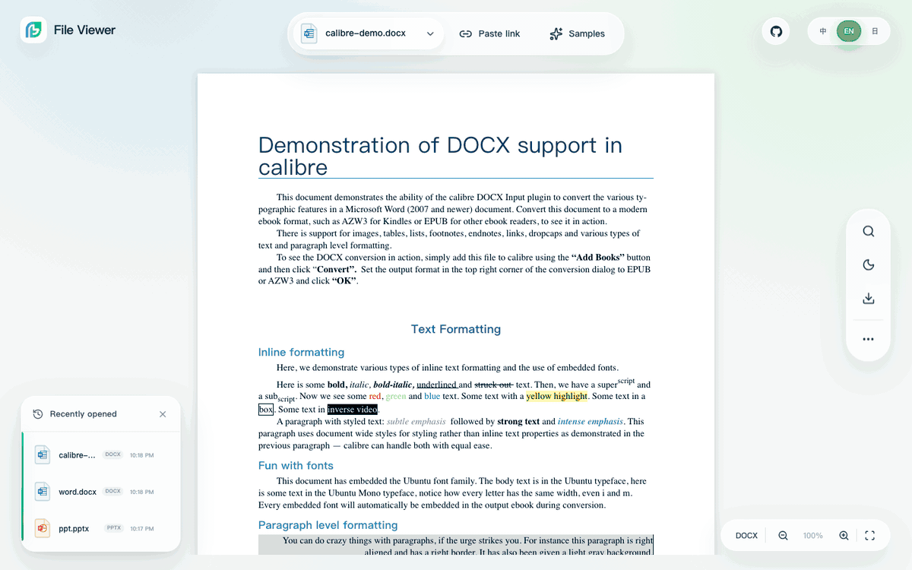

<p align="center">
  <a href="https://file-viewer.app/en/"></a>
</p>

<h1 align="center">File Viewer</h1>

<p align="center"><strong>Uploading a private DOCX or DWG just to preview it is awful.</strong></p>

<p align="center">
  File Viewer is a browser-native file viewer for private and internal web apps. It previews Office, PDF/OFD, CAD, archives, email, diagrams, 3D, media and data without server-side conversion. Workers, WASM, fonts and vendor assets can stay on your network.
</p>

<p align="center">
  <strong>English</strong> · <a href="README.zh-CN.md"><strong>简体中文</strong></a>
</p>

<p align="center">
  <a href="https://file-viewer.app/en/"><strong>Official Website</strong></a> ·
  <a href="https://demo.file-viewer.app/"><strong>Live Demo</strong></a> ·
  <a href="#quick-start"><strong>Quick Start</strong></a> ·
  <a href="https://file-viewer.app/en/cli/"><strong>CLI</strong></a> ·
  <a href="https://doc.file-viewer.app/"><strong>Documentation</strong></a> ·
  <a href="https://file-viewer.app/en/browser-file-viewer/"><strong>Verified Facts</strong></a> ·
  <a href="https://doc.file-viewer.app/guide/formats"><strong>Format Matrix</strong></a> ·
  <a href="https://github.com/flyfish-dev/file-viewer/releases" aria-label="GitHub Releases"><strong>Releases</strong></a> ·
  <a href="https://github.com/sponsors/wybaby168"><strong>Sponsor</strong></a>
</p>

<p align="center">
  <a href="https://github.com/flyfish-dev/file-viewer/actions/workflows/public-ci.yml"></a>
  <a href="https://www.npmjs.com/package/@file-viewer/core"></a>
  <a href="https://www.npmjs.com/package/@file-viewer/core"></a>
  <a href="https://github.com/flyfish-dev/file-viewer"></a>
  <a href="https://hub.docker.com/r/flyfishdev/file-viewer"></a>
</p>

<p align="center">
  <a href="https://demo.file-viewer.app/"></a>
</p>

## Why File Viewer

Uploading private files to a SaaS converter is awful. Running a separate preview backend for each format is not much better. File Viewer keeps the preview path in the browser and gives the host app one API.

- **No mandatory conversion backend.** Files are parsed and rendered in the browser whenever the format allows it.
- **Offline and private-deployment friendly.** Runtime code, renderers, Workers, WASM and vendor assets can all be hosted inside your network.
- **One component API.** Use the same source, lifecycle, toolbar, search, zoom, print and export concepts across formats.
- **Modular by design.** Start with the Standard profile, choose exact renderers, or retain the established Full compatibility package for an existing application.
- **Lazy heavy pipelines.** PDF, CAD, Typst, archives and other heavy capabilities load by format instead of inflating the first screen.
- **Framework-native packages.** Vanilla/Web Component comes first, with production packages for React, Vue, Svelte and jQuery.

## Project Identity

File Viewer by Flyfish uses the `@file-viewer/*` npm scope and the [`flyfish-dev/file-viewer`](https://github.com/flyfish-dev/file-viewer) repository. Verify a release through that repository, its public release page, and the published npm package metadata.

The current source of truth is the [verified facts page](https://file-viewer.app/en/browser-file-viewer/). Historical `@flyfish-group/*` package names remain compatibility aliases; `doc.flyfish.dev` is a legacy documentation domain and should resolve to `doc.file-viewer.app`.

## Quick Start

The CLI creates a runnable project or integrates an existing `package.json` application. It detects the framework and package manager, shows the exact packages and asset work before writing, and keeps heavy formats explicit.

```bash
# New project
npm create file-viewer@latest my-viewer

# Existing project
npx file-viewer-cli@latest add .
```

Use the [CLI homepage](https://file-viewer.app/en/cli/) and [complete guide](https://doc.file-viewer.app/guide/cli) for framework versions, format selection, private registries, offline tarballs and deterministic CI. Manual package installation remains supported.

### Web Component / Vanilla JS

```bash
npm install @file-viewer/web-full
```

```js
import { mountViewer } from '@file-viewer/web-full'

mountViewer(document.querySelector('#viewer'), {
  url: '/documents/handbook.pdf',
  filename: 'handbook.pdf'
})
```

### React 18 / 19

```bash
npm install @file-viewer/react-full
```

```tsx
import { FileViewer } from '@file-viewer/react-full'

export function Preview() {
  return <FileViewer url="/documents/handbook.pdf" />
}
```

### Vue 3

```bash
npm install @file-viewer/vue3-full
```

```vue
<script setup lang="ts">
import { FileViewer } from '@file-viewer/vue3-full'
</script>

<template>
  <FileViewer url="/documents/handbook.pdf" />
</template>
```

| Framework                  | Light package                                 | Full package                     | Guide                                                                    |
| -------------------------- | --------------------------------------------- | -------------------------------- | ------------------------------------------------------------------------ |
| Vanilla JS / Web Component | `@file-viewer/web`                            | `@file-viewer/web-full`          | [Web](https://doc.file-viewer.app/guide/quickstart-web)                  |
| React 18 / 19              | `@file-viewer/react`                          | `@file-viewer/react-full`        | [React](https://doc.file-viewer.app/guide/quickstart-react)              |
| React 16.8 / 17            | `@file-viewer/react-legacy`                   | `@file-viewer/react-legacy-full` | [React Legacy](https://doc.file-viewer.app/guide/ecosystem#react-legacy) |
| Vue 3                      | `@file-viewer/vue3`                           | `@file-viewer/vue3-full`         | [Vue 3](https://doc.file-viewer.app/guide/quickstart-vue3)               |
| Vue 2.7 / 2.6              | `@file-viewer/vue2.7` / `@file-viewer/vue2.6` | matching `-full` package         | [Vue 2](https://doc.file-viewer.app/guide/quickstart-vue2)               |
| Svelte                     | `@file-viewer/svelte`                         | `@file-viewer/svelte-full`       | [Svelte](https://doc.file-viewer.app/guide/quickstart-svelte)            |
| jQuery                     | `@file-viewer/jquery`                         | `@file-viewer/jquery-full`       | [jQuery](https://doc.file-viewer.app/guide/ecosystem#jquery)             |

### Complete Full Package Delivery — Existing Compatibility

The eight official Full packages are `@file-viewer/web-full`, `@file-viewer/vue3-full`, `@file-viewer/vue2.7-full`, `@file-viewer/vue2.6-full`, `@file-viewer/react-full`, `@file-viewer/react-legacy-full`, `@file-viewer/svelte-full`, and `@file-viewer/jquery-full`. They retain the published v2.4 `preset-all` contract: 221 extensions across 32 preview pipelines, including existing iWork and other established behavior. Do not install or pass another preset to these packages.

New heavy formats do not silently enlarge those packages. The CLI's explicit `--profile full` choice composes the compatibility Full package with every additional renderer in that CLI release; the default `standard` profile stays smaller. Each compatibility Full package retains its same-version Worker, WASM, font, and vendor payload. Complete self-hosted delivery uses one of these paths:

| Build / delivery path                            | Complete asset step                                                                                                                              |
| ------------------------------------------------ | ------------------------------------------------------------------------------------------------------------------------------------------------ |
| Vite                                             | Install `@file-viewer/vite-plugin` and use `fileViewerRenderers({ copyAssets: true })`; dev and build publish the matching assets automatically. |
| Webpack / Rspack / Rollup / Vue CLI / Umi        | Run the same-version CLI included by the Full package: `npx --no-install file-viewer-copy-assets ./public/file-viewer`.                          |
| `@file-viewer/web-full` CDN/IIFE or self-hosting | Use the CDN entry directly, or deploy its complete `dist/` directory intact. Copying only the entry IIFE is incomplete.                          |

The default asset URL is `<deployment-base>/file-viewer/`. Without the complete asset tree, lightweight formats and a few compatibility paths may still work, but the deployment is not full-format complete.

## Choose By Scenario

**84 npm targets, 244 registered extensions, and 34 preview pipelines** mean you can start with the file problem you have today instead of assembling a different viewer for every attachment type.

| Your product needs to preview                        | Formats you can look for immediately                                         | Fastest path                                                                                                                                        |
| ---------------------------------------------------- | ---------------------------------------------------------------------------- | --------------------------------------------------------------------------------------------------------------------------------------------------- |
| Contracts, reports and OA/CRM attachments            | PDF/OFD, DOCX/DOC, XLSX/XLS, PPT/PPTX, RTF and OpenDocument                  | [Try the live demo](https://demo.file-viewer.app/) · [`preset-office`](https://doc.file-viewer.app/guide/on-demand-renderers)                       |
| Engineering drawings, models and chip/design assets  | DWG, DXF, DWF/DWFX, STEP/IFC/3D, OLB/DRA and GDS/OASIS                       | [`preset-engineering`](https://doc.file-viewer.app/guide/on-demand-renderers) · [check fidelity](https://doc.file-viewer.app/guide/format-fidelity) |
| Archives whose contents must remain private          | ZIP, RAR, 7Z, TAR, ISO and 20+ related formats, with nested file preview     | [Archive coverage](https://doc.file-viewer.app/guide/formats) · [offline deployment](https://doc.file-viewer.app/guide/distribution)                |
| Email, support-ticket and knowledge-base attachments | EML, MSG, MBOX, EPUB, Markdown, source code, diff/patch and Git bundle       | [Full format matrix](https://doc.file-viewer.app/guide/formats) · [full packages](#quick-start)                                                     |
| Diagrams, design files and structured data           | Draw.io, Excalidraw, Mermaid, PlantUML, XMind, PSD, SQLite, Parquet and more | [Full format matrix](https://doc.file-viewer.app/guide/formats) · [`preset-all`](#choose-the-right-package)                                         |
| Intranet or air-gapped deployment                    | Self-hosted JavaScript, Worker, WASM, fonts and vendor assets                | [Offline guide](https://doc.file-viewer.app/guide/distribution) · [Docker](https://doc.file-viewer.app/guide/docker)                                |

Looking for one exact suffix? Search the maintained [244-extension format matrix](https://doc.file-viewer.app/guide/formats), which records the renderer, support level, evidence status, and deployment requirements for each pipeline.

## Choose the Right Package

| Path                  | Choose it when                                                              | What you provide                                     |
| --------------------- | --------------------------------------------------------------------------- | ---------------------------------------------------- |
| CLI Standard          | You want a runnable, measured common-format baseline                        | `npm create file-viewer@latest` or `file-viewer add` |
| Light component       | You need the smallest shell and explicit control                            | Individual renderers or a preset in `options.preset` |
| `preset-lite`         | Text, code, images and lightweight common previews are enough               | Component + `@file-viewer/preset-lite`               |
| `preset-office`       | Your product centers on PDF and Office documents                            | Component + `@file-viewer/preset-office`             |
| `preset-engineering`  | CAD, drawing, 3D, EDA or engineering data matters                           | Component + `@file-viewer/preset-engineering`        |
| Vite plugin           | You want installed presets detected and offline assets copied automatically | `@file-viewer/vite-plugin`                           |
| Existing Full package | You need the unchanged v2.4 compatibility matrix                            | A matching `@file-viewer/*-full` package             |
| CLI Full              | You explicitly want every renderer cataloged by this CLI release            | `file-viewer create/add --profile full`              |

```ts
import officePreset from '@file-viewer/preset-office'
import { FileViewer } from '@file-viewer/vue3'

// options.preset accepts one preset or an array of presets.
const options = { preset: officePreset }
```

See [on-demand renderers and presets](https://doc.file-viewer.app/guide/on-demand-renderers) for asset copying, plugin configuration and custom combinations.

## Capability at a Glance

The current catalog maps 244 registered extensions (221 stable, 23 experimental) across 34 preview pipelines, distributed through **84 npm targets**. Presentation preview deliberately keeps two engine boundaries: PowerPoint 97–2003 `.ppt`/`.pot` uses the native-WASM `@file-viewer/ppt@0.3.3` engine, while PPTX/OpenXML uses the `@file-viewer/pptx` Worker engine. Apple Pages, Numbers, and Keynote provide static high-fidelity preview across iWork '09, 2013+, and current fixtures; WordPerfect and Hangul provide stable structured preview backed by licensed genuine fixtures and Chromium, Firefox, and WebKit smoke. Spreadsheet preview retains Office 365/WPS in-cell images, workbook drawings, double-click image previews, table styles and optional column resizing. Multipage CCITT Group 4 TIFF uses a bounded TIFF-only lazy decoder, and the Vite plugin selects Rollup or Rolldown chunk configuration from the installed Vite major without replacing application-owned groups. DICOM and digital-signature/evidence containers are explicit heavy renderers; neither enters Standard or an existing Full compatibility package automatically. Other major groups include PDF/OFD; Office and iWork; DWG/DXF/DWF/DWFX; archives; EML/MSG; EPUB/FB2; Markdown and source code; drawings; PSD and images; media; 3D/geo/data/EDA; and Typst.

The exact implementation and support level varies by format. Use the maintained [format matrix](https://doc.file-viewer.app/guide/formats) as the source of truth rather than inferring support from an extension alone.

## Document Text Comparison

The standalone [comparison demo](https://demo.file-viewer.app/compare.html) keeps two live previews side by side and can turn their extracted text into a real jsdiff view. It aligns lines, marks exact character additions and removals, counts each change type, and lets you jump between changes. DOCX and text files are the stable path today. PDF support is staged: reading order follows the PDF text layer, scans still need OCR, and incomplete multi-page extraction stops with a clear message instead of presenting a partial result.

## Honest Boundaries

- File Viewer is a **read-only preview toolkit**, not an Office or CAD editor.
- Visual fidelity differs by file structure, embedded fonts, vendor extensions and browser capabilities.
- Heavy formats use the local Worker/WASM/vendor assets carried by their packages; offline deployment means publishing that version-aligned payload on your own origin.
- Very large or encrypted files can require more memory and format-specific configuration.
- A light component does not silently include every renderer. Install a preset, individual renderers, or a full package.

If a documented format fails on a real file, the most useful contribution is a **sanitized sample**, browser/version details and a minimal reproduction.

## Support the Work

I started working on the idea behind File Viewer in 2022 because uploading private files to another service just to preview them felt wrong. The hard part now is not the happy-path demo. It is reproducing broken Office files, CAD edge cases, encrypted archives, Worker paths, WASM assets and old framework builds.

If File Viewer saves your team time, [sponsor the maintenance](https://github.com/sponsors/wybaby168). It buys focused time for compatibility tests, fixes, documentation and releases. Open-source features stay open.

- [GitHub Sponsors](https://github.com/sponsors/wybaby168): one-time or monthly support.
- [WeChat / Alipay](https://dev.flyfish.group/sponsor?source=github): one-time support for domestic users.
- [Enterprise support](https://dev.flyfish.group/shop): private deployment, custom file compatibility or work that needs a committed response time.

### Thanks to Our Sponsors

Thank you for supporting the compatibility work, documentation, and releases that keep File Viewer moving forward.

<p align="center">
  <a href="https://github.com/p4535992" title="@p4535992 on GitHub">
    
  </a>
</p>

## Architecture

```text
framework component / Web Component
              │
        @file-viewer/core
              │
     preset or renderer modules
              │
 local workers · WASM · vendor assets

@file-viewer/cli selects and verifies this graph for a project.
```

`@file-viewer/core` is framework-independent TypeScript. Renderer packages own format pipelines; presets compose them; each framework package implements its native lifecycle without nesting another framework implementation.

<!-- FILE_VIEWER_PUBLIC_GENERATED:START -->

## Open-source Workspace

This repository contains the public source for the demo, documentation, framework-independent core, renderer pipelines, presets, Vite plugin and standard framework components. Release archives and npm tarballs live in [GitHub Releases](https://github.com/flyfish-dev/file-viewer/releases), not in Git history.

```bash
pnpm install --frozen-lockfile
pnpm type-check
pnpm test
pnpm build
pnpm docs:build
pnpm verify:browser-smoke
```

| Area                        | Location                                                   |
| --------------------------- | ---------------------------------------------------------- |
| Core                        | [`packages/core`](packages/core)                           |
| Renderers                   | [`packages/renderers`](packages/renderers)                 |
| Presets and Vite plugin     | [`packages/presets`](packages/presets)                     |
| Components                  | [`packages/components`](packages/components)               |
| Project and integration CLI | [`packages/tools/cli`](packages/tools/cli)                 |
| Legacy-compatible asset CLI | [`packages/tools/copy-assets`](packages/tools/copy-assets) |
| Runnable examples           | [`examples`](examples)                                     |
| Demo                        | [`apps/viewer-demo`](apps/viewer-demo)                     |
| Documentation               | [`docs`](docs)                                             |

<!-- FILE_VIEWER_PUBLIC_GENERATED:END -->

## Documentation and Delivery

- [Quick start](https://doc.file-viewer.app/guide/quickstart)
- [CLI project creation and integration](https://doc.file-viewer.app/guide/cli)
- [Format matrix](https://doc.file-viewer.app/guide/formats)
- [API and options](https://doc.file-viewer.app/guide/usage)
- [Offline deployment](https://doc.file-viewer.app/guide/distribution)
- [CLI homepage](https://file-viewer.app/en/cli/): create, add, select, prepare, doctor and legacy-compatible asset copying
- [Docker](https://doc.file-viewer.app/guide/docker)
- [Framework packages](https://doc.file-viewer.app/guide/ecosystem)
- [Releases and downloadable archives](https://github.com/flyfish-dev/file-viewer/releases)

## Contributing

Compatibility reports, deployment feedback, focused fixes and sanitized regression samples are welcome. Every bug report must include a public/sanitized sample, a public reproduction link, or a dated note that the private sample was sent to `admin@flyfish.dev`; screenshots do not replace the sample. Read [CONTRIBUTING.md](CONTRIBUTING.md) and [SECURITY.md](SECURITY.md) before opening an issue or pull request.

Apache-2.0 licensed. Community links, Wiki and acknowledgements are available in the [documentation](https://doc.file-viewer.app/) and repository sidebar.
