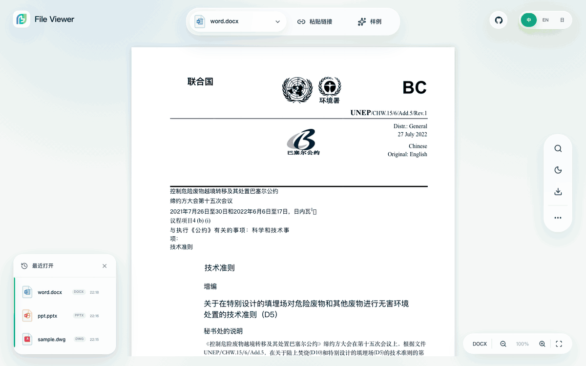

<p align="center">
  <a href="https://file-viewer.app/"></a>
</p>

# File Viewer

File Viewer 为 Web 应用提供只读文件预览。Office 文档、PDF/OFD、压缩包、邮件、CAD 等格式由浏览器中的渲染器处理，不要求另建转码服务。业务系统提供文件，Worker、WASM、字体等运行时资源可以部署在自己的网络中。

[English](README.md) | [简体中文](README.zh-CN.md) | [在线 Demo](https://demo.file-viewer.app/) | [文档](https://doc.file-viewer.app/) | [格式矩阵](https://doc.file-viewer.app/guide/formats) | [版本下载](https://github.com/flyfish-dev/file-viewer/releases)

[](https://github.com/flyfish-dev/file-viewer/actions/workflows/public-ci.yml)
[](https://www.npmjs.com/package/@file-viewer/core)

[](https://demo.file-viewer.app/)

## 快速开始

不使用框架时，可以直接挂载 Web Component：

```bash
npm install @file-viewer/web-full
```

```js
import { mountViewer } from '@file-viewer/web-full'

mountViewer(document.querySelector('#viewer'), {
  url: '/documents/handbook.pdf',
  filename: 'handbook.pdf'
})
```

请给 `#viewer` 设置高度。URL 需要能由浏览器访问；跨域文件需要正确的 CORS 响应头。也可以传入 `File`，不必使用 URL。

新项目可运行 `npm create file-viewer@latest my-viewer`，已有项目可运行 `npx file-viewer-cli@latest add .`。CLI 会列出将安装的包和需要部署的资源，详见 [CLI 文档](https://doc.file-viewer.app/guide/cli)。

| 应用 | 轻量组件 | Full 兼容包 | 接入文档 |
| --- | --- | --- | --- |
| 原生 JS / Web Component | `@file-viewer/web` | `@file-viewer/web-full` | [Web](https://doc.file-viewer.app/guide/quickstart-web) |
| Vue 3 | `@file-viewer/vue3` | `@file-viewer/vue3-full` | [Vue 3](https://doc.file-viewer.app/guide/quickstart-vue3) |
| Vue 2.7 / 2.6 | `@file-viewer/vue2.7` / `@file-viewer/vue2.6` | 对应的 `-full` 包 | [Vue 2](https://doc.file-viewer.app/guide/quickstart-vue2) |
| React 18 / 19 | `@file-viewer/react` | `@file-viewer/react-full` | [React](https://doc.file-viewer.app/guide/quickstart-react) |
| React 16.8 / 17 | `@file-viewer/react-legacy` | `@file-viewer/react-legacy-full` | [React Legacy](https://doc.file-viewer.app/guide/ecosystem#react-legacy) |
| Svelte | `@file-viewer/svelte` | `@file-viewer/svelte-full` | [Svelte](https://doc.file-viewer.app/guide/quickstart-svelte) |
| jQuery | `@file-viewer/jquery` | `@file-viewer/jquery-full` | [jQuery](https://doc.file-viewer.app/guide/ecosystem#jquery) |

轻量组件内置基线之外的格式，需要再装配 preset 或 renderer，例如：

```ts
import officePreset from '@file-viewer/preset-office'
import { FileViewer } from '@file-viewer/vue3'

const options = { preset: officePreset }
```

`options.preset` 也接受数组。具体组合见 [按需渲染器文档](https://doc.file-viewer.app/guide/on-demand-renderers)。

## 格式与限制

[格式矩阵](https://doc.file-viewer.app/guide/formats)列出扩展名、对应渲染器、支持级别和验证依据。除常见文档与媒体外，还有工程图纸、三维模型和设计文件等专业格式。列入矩阵不代表同一扩展名下的所有文件都能得到相同的还原效果。

八个 `*-full` 包保留已发布的 v2.4 `preset-all` 兼容基线，即 221 个扩展名、32 条预览链路。Adobe 设计文件、DICOM、二进制检查等新增专业渲染器需要显式安装，不会自动进入既有 Full 包。希望缩小安装范围时，可以用轻量组件搭配 `@file-viewer/preset-lite`、`@file-viewer/preset-office`、`@file-viewer/preset-engineering` 或单独的 renderer。

本项目是预览器，不是编辑器。字体、厂商私有特性、加密文件和超大文件都可能影响还原效果或内存占用。生产接入前请用实际业务文件验证目标格式。

## 运行时资源

Full 包包含匹配版本的 Worker、WASM、字体与 vendor 文件，但应用仍须把这些文件部署出去。默认资源路径为 `<部署基址>/file-viewer/`。

| 构建或交付方式 | 资源步骤 |
| --- | --- |
| Vite | 安装 `@file-viewer/vite-plugin`，配置 `fileViewerRenderers({ copyAssets: true })`。 |
| Webpack、Rspack、Rollup、Vue CLI、Umi | 安装对应 Full 包后运行 `npx --no-install file-viewer-copy-assets ./public/file-viewer`。 |
| Web Full IIFE / CDN | 部署完整的包内 `dist/` 目录，而不是只复制入口 JS。 |

二进制 PPT 使用的 `@file-viewer/ppt@0.3.4` 运行时也需要随配套资源交付。自定义路径与离线部署见[资源分发文档](https://doc.file-viewer.app/guide/distribution)；仅安装 JS 包而漏掉 Worker 或 WASM，会导致相应格式无法使用。

<!-- FILE_VIEWER_PUBLIC_GENERATED:START -->

## 从源码运行

本仓库提供 core、渲染器、preset、组件、CLI、Demo 和文档的公开源码。已发布的归档和 npm tarball 在 [GitHub Releases](https://github.com/flyfish-dev/file-viewer/releases) 下载，不放入 Git 历史。

```bash
pnpm install --frozen-lockfile
pnpm type-check
pnpm test
pnpm build
pnpm docs:build
pnpm verify:browser-smoke
```

<!-- FILE_VIEWER_PUBLIC_GENERATED:END -->

## 反馈与支持

遇到格式兼容问题，请提供脱敏样例或公开复现链接、浏览器版本和预期结果。截图有助于说明现象，但通常不足以定位解析错误。提交 PR 前请阅读 [CONTRIBUTING.md](CONTRIBUTING.md)；安全问题请按 [SECURITY.md](SECURITY.md) 报告。

可通过 [GitHub Sponsors](https://github.com/sponsors/wybaby168) 支持维护；私有化部署或需要约定响应时间的工作，请使用[企业支持入口](https://dev.flyfish.group/shop)。

### 感谢以下赞助者

<a href="https://github.com/p4535992"></a>

## 许可证

File Viewer 自有源码采用 Apache-2.0。DWG/DWF/DWFX 运行时（`@flyfish-dev/cad-viewer` 和 `dwf-viewer`）采用 **AGPL-3.0-only**；使用或分发 CAD 能力时需遵守该许可证。详见 [LICENSE](LICENSE) 和运行时包的授权说明。
