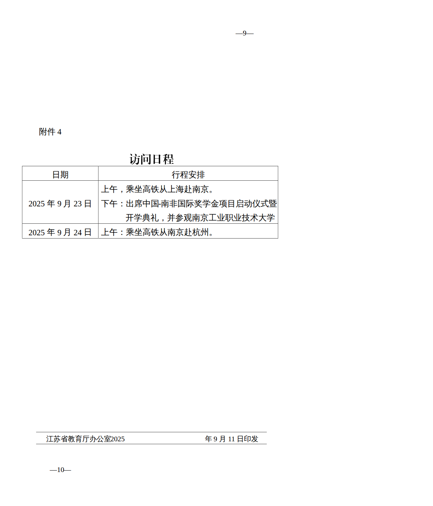
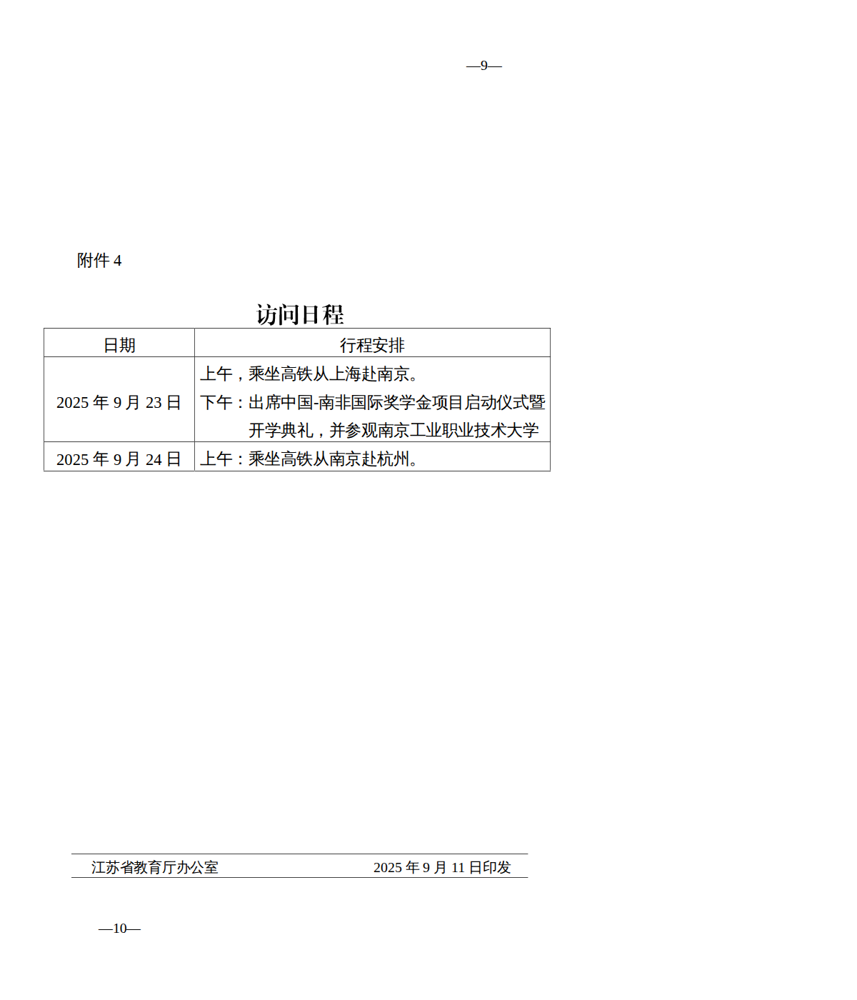
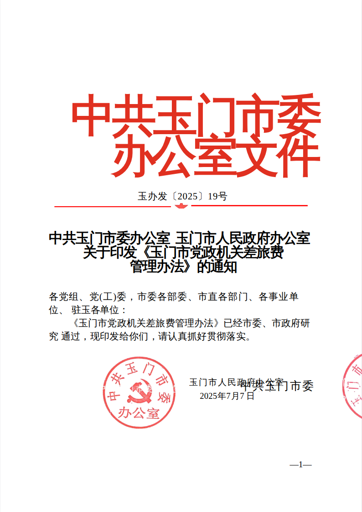
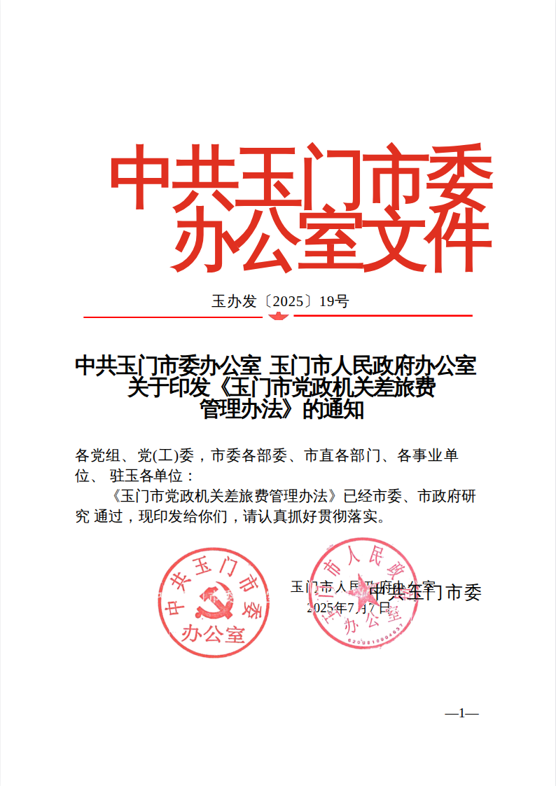
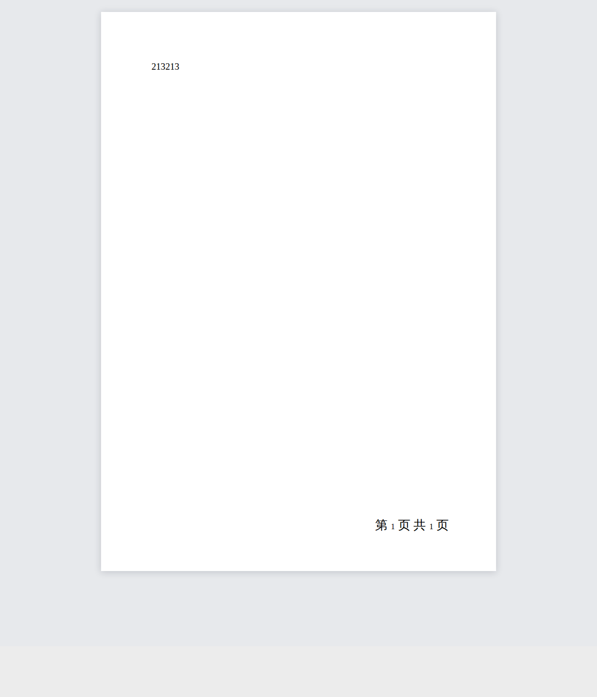

# Original document sample regressions (#266)

> **Maintainer-only commands:** this page contains complete-workspace release or verification examples that are not part of the public checkout. Public contributors should use the commands in `/README.md` or `/docs/guide/development.md`.

<!-- FILE_VIEWER_MAINTAINER_COMMANDS -->

Report: https://github.com/flyfish-dev/file-viewer/issues/266

Public/sanitized attachment: https://github.com/user-attachments/files/32040630/default.zip

SHA-256: `57345ed8469bfae8ccb066abb726a551d0c322f5af7527828771035551cff4cb`

## Reproduction and root causes

The four original files are tested rather than substitutes with similar names.

| Original | Baseline | Change and verification |
| --- | --- | --- |
| `333.ofd` | Footer year is shifted left. The XML parser trims 22 leading spaces; the renderer discards character advances and merges independent same-baseline TextCodes. | Retain TextCode whitespace; render independent runs with explicit SVG X/Y lists. First visible digit follows all 22 authored advances. All 10 pages render. |
| `测试模板.doc` | Throws `Not a Compound File Binary document`. Its actual container is Word 2003 XML, not binary DOC. | Detect the container and structurally adapt its body/styles/section/header/footer parts for the existing OOXML renderer. The original body and PAGE/NUMPAGES footer render on one page. |
| `…通知-正文.docx` | One stamp is outside the page. A paragraph-relative vertical anchor changes its containing block, incorrectly adding paragraph indentation to the column-relative horizontal offset. | A narrow mixed-axis compatibility correction preserves the authored left offset and column/margin origin without changing vertical placement. Four stamps match the source EMU offsets at 60%, 100%, 140%, then 100% zoom. The original 13 sections and four tables remain. |
| `测试发票.ofd` | Renders one page with an existing unsupported-SES-signature-structure warning. | Page rendering is preserved; the warning is explicitly recorded, not hidden or presented as fixed. |

## Scope and remaining findings

Ordinary table cell borders already render on the baseline. They are checked for
regressions, not claimed as a newly repaired issue. The first table's diagonal
`w:tl2br` border is not supported by the installed `@file-viewer/docx@0.3.31`
engine and is a separate upstream finding; this PR does not claim to fix it.

The WordML adapter is structural conversion of the supported container elements,
not a promise of complete Word 2003 feature parity. It rejects DTD/entity input,
malformed XML and excessive nesting, uses package-local embedded image parts,
and never downloads image URLs. Binary DOC and renamed ZIP/OOXML routes remain
unchanged. UTF-8 and both UTF-16 byte orders are covered.

No font substitutions or content-specific offsets are embedded in production
code. The mixed-anchor correction is idempotent and leaves page/character axes
and table-cell layout to the engine. No dependency version is changed.

## Completed checks

```sh
pnpm test:word-github-266
pnpm test:ofd-github-266
pnpm --filter @file-viewer/renderer-ofd verify:render-fidelity
pnpm --filter @file-viewer/renderer-ofd verify:github-94
pnpm --filter @file-viewer/renderer-ofd verify:image-placement
pnpm --filter @file-viewer/renderer-ofd verify:pageblock-render
# Build the workspace/core first. The browser harness downloads nothing.
pnpm verify:github-266-browser /path/to/default.zip
```

The 20 Word Node tests cover container routing, headers/footers, field aliases,
section structure, embedded/external images, malformed input, mixed anchor axes,
zoom and idempotence, plus the existing RTF security tests. OFD coverage includes
compressed/bounded deltas, Unicode, explicit X/Y advances and independent runs.

The original-file browser gate uses an in-memory Chromium document and pins the
attachment hash. It reports all four originals, fails on unexpected render
errors or HTTP requests, and permits only the explicitly recorded pre-existing
invoice signature warning. `--baseline` asserts the old failures, not success.

| Before | After |
| --- | --- |
|  |  |
|  |  |
|  |  |

The PR only references the issue; it does not reply to or automatically close it.
