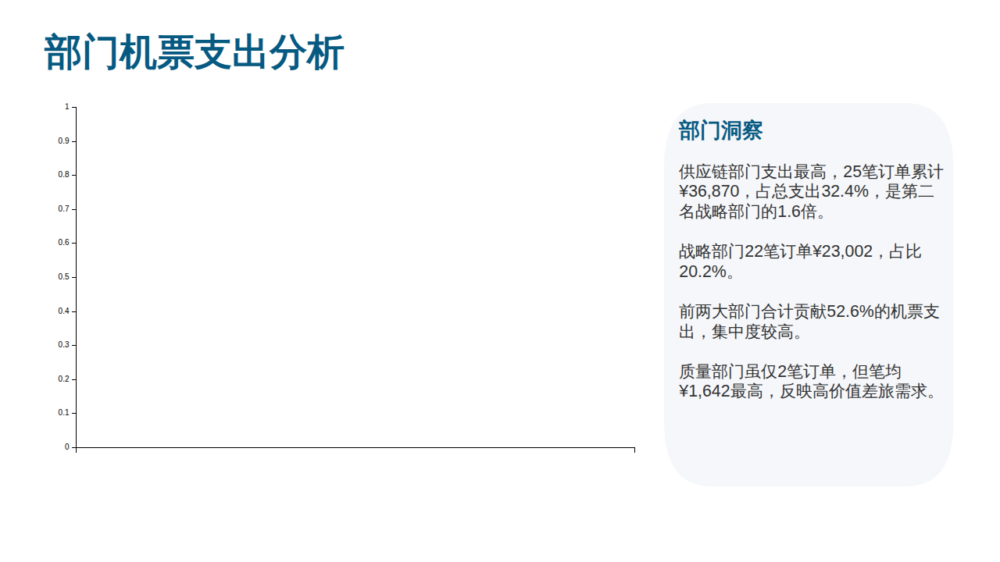
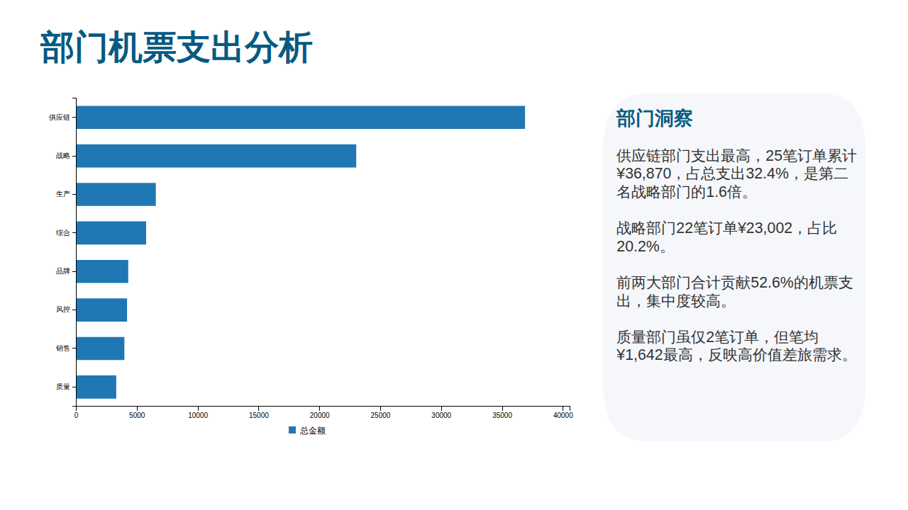
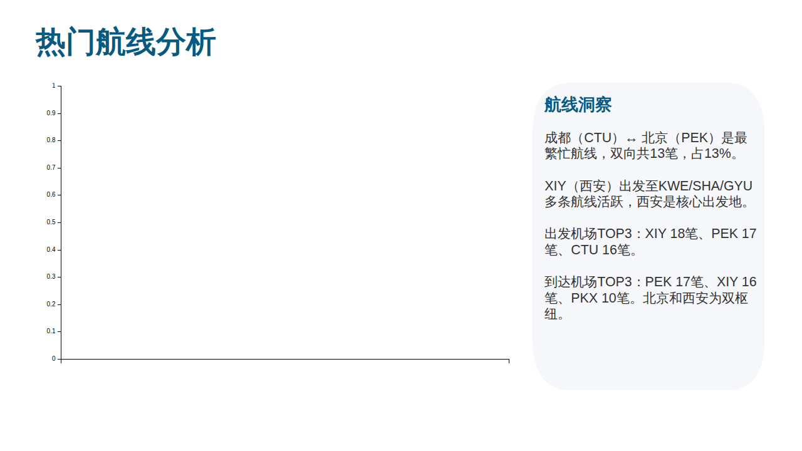
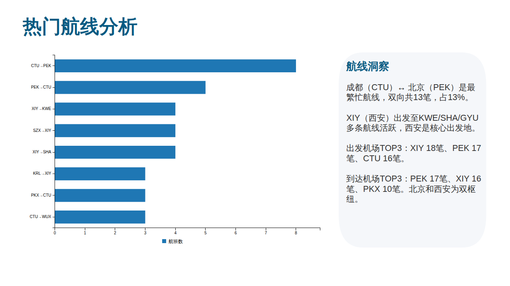

# PPTX literal chart data regression (#268)

Public report: https://github.com/flyfish-dev/file-viewer/issues/268

Public sample (in the reporter's comment): https://github.com/user-attachments/files/32082894/default.pptx

SHA-256: `4b0dfef0400a6194f86c3deb1234fdf84828f696f2f3915fe940cbb43f5ed30c`

## Root cause

The five charts store categories/values directly in `c:strLit` / `c:numLit` and
series names in `c:tx/c:v`. The previous extractor read only reference caches,
so chart placeholders were rendered with empty datasets. A horizontal bar chart
also lost its `c:barDir` orientation between parsing and Billboard rendering.

The extractor now reads literal and cached data through one indexed path,
preserves zero, aligns sparse series by index, treats invalid values as missing,
and does not allocate arrays based on untrusted `idx` or `ptCount` values.
Existing cached charts and the existing scatter data shape remain supported.

## Verification

```sh
pnpm test:pptx-github-268
pnpm --filter @file-viewer/pptx verify:github-176
# Supply the downloaded public sample; this command does not download documents.
pnpm --filter @file-viewer/pptx verify:github-268-browser /path/to/default.pptx
```

The browser check pins the original file hash, uses the actual parser and
Billboard renderer, renders eight slides entirely in memory, and asserts:

- Before: five empty datasets, zero bars/arcs/line points.
- After: chart point counts `[8, 10, 8, 8, 5]`, 26 bars, 8 pie arcs, 5 line points.
- No browser render errors or HTTP requests; chart cleanup is idempotent.

The attachment contains no native `a:tbl` table. Its table-like summary cards
are ordinary text/shapes; do not cite this sample as proof of native-table support.

Matched 1280-by-740 browser viewport captures are kept with this regression:

| Before | After |
| --- | --- |
|  |  |
|  |  |

No dependency upgrades, external data fetches, package releases or issue replies
are required by this fix. The ordinary PR CI also runs the deterministic unit gate.
