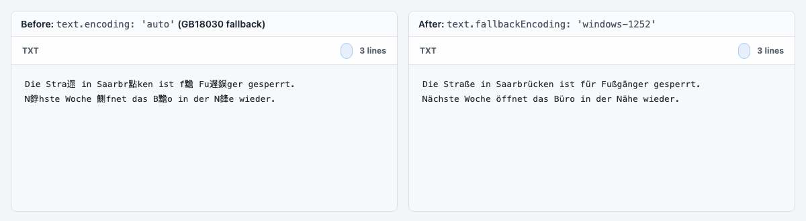

# Single-byte text encodings and the `auto` fallback

## Problem

`options.text.encoding: 'auto'` resolved every buffer that is not UTF-8 or
UTF-16 to GB18030. An ISO-8859-1 or Windows-1252 `txt` file such as
`Die Straße in Saarbrücken` rendered as `Die Stra遝 in Saarbr點ken`, because
byte pairs like `FC 63` are structurally valid GBK. Windows-1251 Cyrillic files
failed the same way. The union did not offer any single-byte encoding, so no
option could correct it, and `locale` only translates the toolbar.



`before-after.png` runs the real `renderText` path from `@file-viewer/renderer-text`
on `test/fixtures/text-encoding/latin1-umlauts.txt` in Chrome. Left: default
`auto`. Right: `text.fallbackEncoding: 'windows-1252'`.

## Configuration

```ts
const options = {
  text: {
    // Used by `auto` for bytes that are not valid UTF-8. Defaults to gb18030.
    fallbackEncoding: 'windows-1252'
  }
}
```

Or pin the decoder when the source is known:

```ts
const options = { text: { encoding: 'iso-8859-1' } }
```

`text.encoding` and `text.fallbackEncoding` accept `iso-8859-1`,
`iso-8859-2`, `iso-8859-15`, `windows-1250`, `windows-1251`, and
`windows-1252` in addition to the existing labels. Common aliases such as
`latin1`, `cp1252`, or `cp1251` normalize to the same decoders.

The default fallback stays `gb18030`, so existing GBK files render exactly as
before. Single-byte text cannot be separated from GB18030 by inspecting the
bytes, which is why the fallback is an explicit option and not a heuristic.
Download continues to return the original bytes.

Browsers decode the `iso-8859-1` label with the windows-1252 table, as the
WHATWG Encoding Standard requires, so both labels produce the same text.

## Affected code

- `@file-viewer/core` `resolveFileViewerTextEncoding` and
  `decodeFileViewerTextBuffer` take an optional third `fallbackEncoding`
  argument. `isSingleByteFileViewerTextEncoding` and
  `DEFAULT_FILE_VIEWER_TEXT_FALLBACK_ENCODING` are exported.
- `@file-viewer/renderer-text` passes the fallback through the code, Markdown,
  HTML source, XML, patch, and virtual large-text paths. The large-text
  renderer treats single-byte encodings as one byte per character when it
  slices long lines into segments and when it maps search matches back to byte
  offsets. It previously reused the UTF-8 continuation-byte alignment, which
  skipped `0x80`–`0xBF` bytes at segment starts.
- CSV / TSV keep their own `spreadsheet.textEncoding` union and are unchanged.

## Regression commands

```sh
pnpm exec vitest run test/text-single-byte-encodings.spec.ts
pnpm type-check
pnpm --filter @file-viewer/renderer-text build
```

Fixtures live in `test/fixtures/text-encoding/`. The Vitest suite covers the
core resolver, alias normalization, UTF-8/BOM/UTF-16 precedence, and a jsdom
run of the virtual large-text renderer with segment slicing and search.
